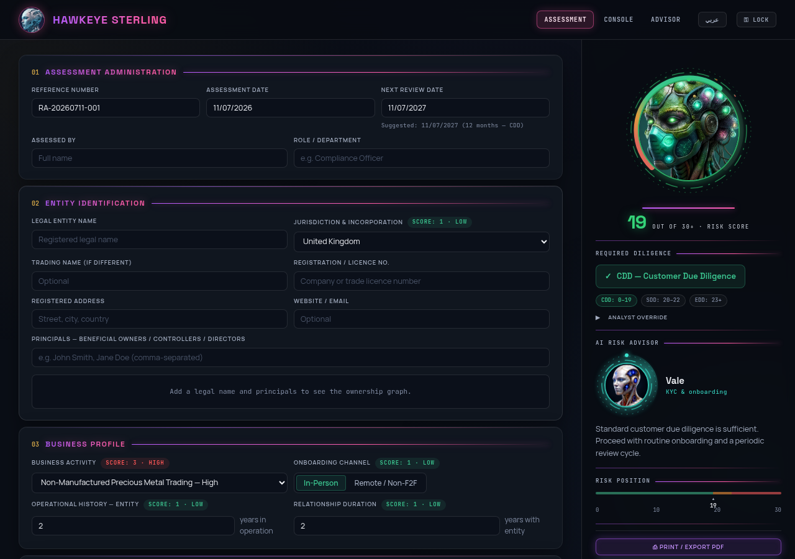
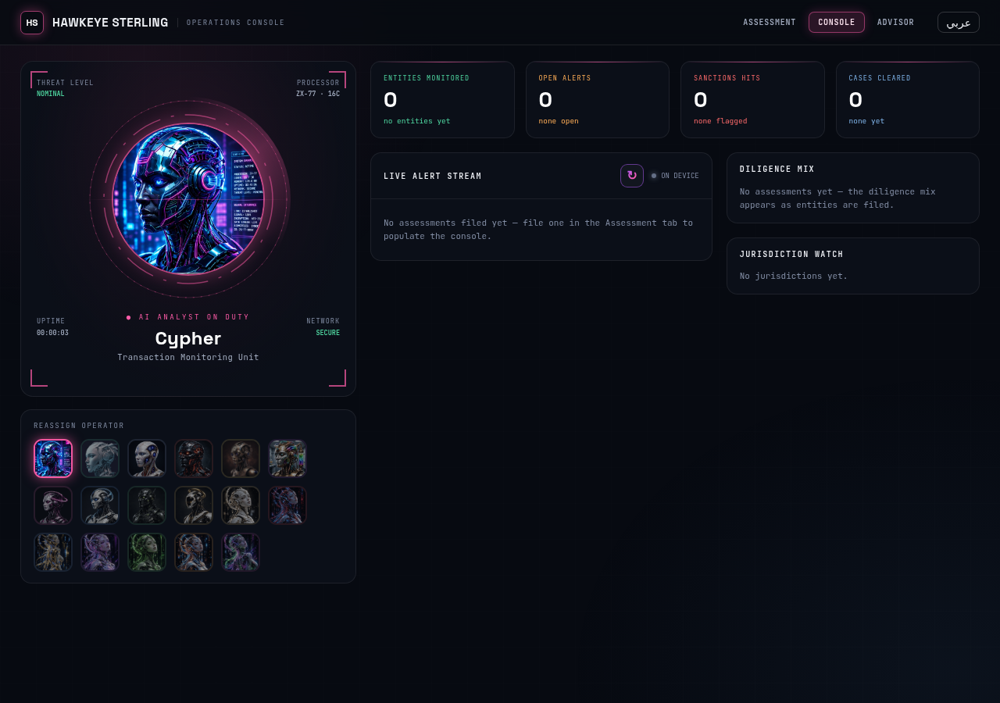
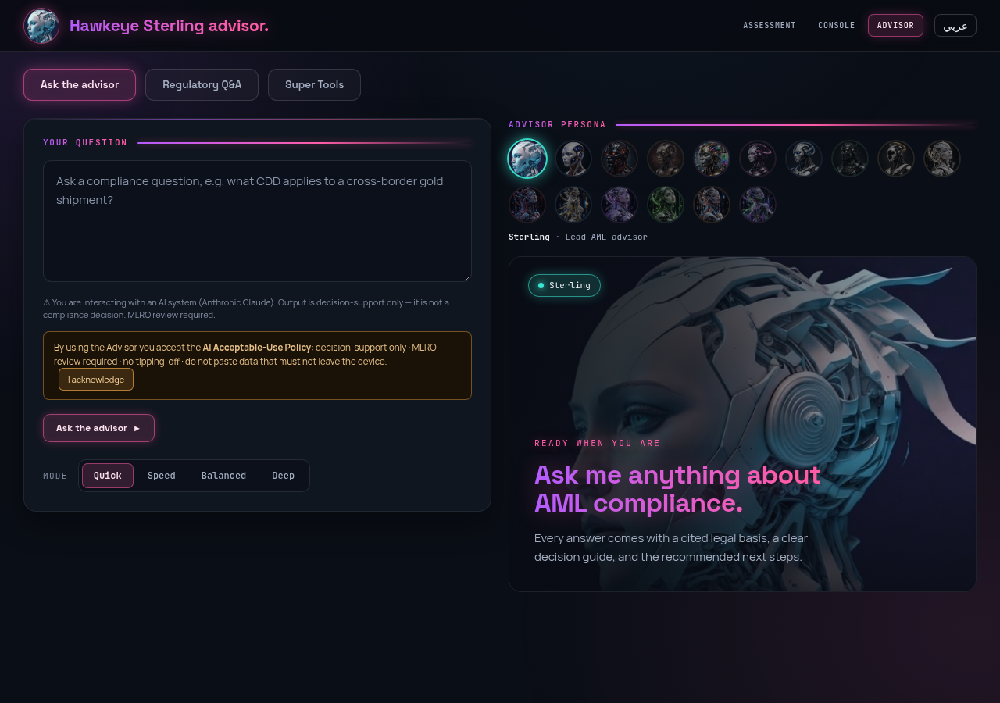

# Hawkeye Sterling — Entity Risk Assessment (RA)

[](https://github.com/trex0092/HAWKEYE-STERLING-RA/actions/workflows/ci.yml)
[](https://github.com/trex0092/HAWKEYE-STERLING-RA/actions/workflows/codeql.yml)
[](https://github.com/trex0092/HAWKEYE-STERLING-RA/actions/workflows/weekly-adverse-media.yml)
[](https://github.com/trex0092/HAWKEYE-STERLING-RA/actions/workflows/freshness-check.yml)
[](https://scorecard.dev/viewer/?uri=github.com/trex0092/HAWKEYE-STERLING-RA)
[](https://github.com/trex0092/HAWKEYE-STERLING-RA/releases)
[](https://app.netlify.com/projects/hawkeye-sterling-ra/deploys)
[](LICENSE)

<!-- Code quality & security gates (push/PR + scheduled) -->
[](https://github.com/trex0092/HAWKEYE-STERLING-RA/actions/workflows/lint.yml)
[](https://github.com/trex0092/HAWKEYE-STERLING-RA/actions/workflows/semgrep.yml)
[](https://github.com/trex0092/HAWKEYE-STERLING-RA/actions/workflows/gitleaks.yml)
[](https://github.com/trex0092/HAWKEYE-STERLING-RA/actions/workflows/osv-scanner.yml)
[](https://github.com/trex0092/HAWKEYE-STERLING-RA/actions/workflows/workflow-lint.yml)
[](https://github.com/trex0092/HAWKEYE-STERLING-RA/actions/workflows/dast-zap.yml)
[](https://github.com/trex0092/HAWKEYE-STERLING-RA/actions/workflows/a11y.yml)
[](https://github.com/trex0092/HAWKEYE-STERLING-RA/actions/workflows/cross-browser.yml)
[](https://github.com/trex0092/HAWKEYE-STERLING-RA/actions/workflows/visual.yml)
[](https://github.com/trex0092/HAWKEYE-STERLING-RA/actions/workflows/docker-smoke.yml)
[](https://github.com/trex0092/HAWKEYE-STERLING-RA/actions/workflows/container-scan.yml)
[](https://github.com/trex0092/HAWKEYE-STERLING-RA/actions/workflows/attestation-verify.yml)

<!-- Live compliance controls (scheduled watchers — a red badge IS the alarm) -->
[](https://github.com/trex0092/HAWKEYE-STERLING-RA/actions/workflows/regulatory-watch.yml)
[](https://github.com/trex0092/HAWKEYE-STERLING-RA/actions/workflows/fatf-watchdog.yml)
[](https://github.com/trex0092/HAWKEYE-STERLING-RA/actions/workflows/sanctions-watch.yml)
[](https://github.com/trex0092/HAWKEYE-STERLING-RA/actions/workflows/sanctions-screen.yml)
[](https://github.com/trex0092/HAWKEYE-STERLING-RA/actions/workflows/link-check.yml)
[](https://github.com/trex0092/HAWKEYE-STERLING-RA/actions/workflows/site-health.yml)
[](https://github.com/trex0092/HAWKEYE-STERLING-RA/actions/workflows/function-health.yml)

<!-- Scheduled ops, reporting & AI assurance (live workflow status) -->
[](https://github.com/trex0092/HAWKEYE-STERLING-RA/actions/workflows/anomaly-watch.yml)
[](https://github.com/trex0092/HAWKEYE-STERLING-RA/actions/workflows/daily-brief.yml)
[](https://github.com/trex0092/HAWKEYE-STERLING-RA/actions/workflows/weekly-summary.yml)
[](https://github.com/trex0092/HAWKEYE-STERLING-RA/actions/workflows/governance-report.yml)
[](https://github.com/trex0092/HAWKEYE-STERLING-RA/actions/workflows/quarterly-review.yml)
[](https://github.com/trex0092/HAWKEYE-STERLING-RA/actions/workflows/onboarding-screen.yml)
[](https://github.com/trex0092/HAWKEYE-STERLING-RA/actions/workflows/compliance-calendar.yml)
[](https://github.com/trex0092/HAWKEYE-STERLING-RA/actions/workflows/asana-reconcile.yml)
[](https://github.com/trex0092/HAWKEYE-STERLING-RA/actions/workflows/advisor-eval.yml)
[](https://github.com/trex0092/HAWKEYE-STERLING-RA/actions/workflows/advisor-bias-eval.yml)
[](https://github.com/trex0092/HAWKEYE-STERLING-RA/actions/workflows/auto-release.yml)
[](https://github.com/trex0092/HAWKEYE-STERLING-RA/actions/workflows/publish-container.yml)
[](https://github.com/trex0092/HAWKEYE-STERLING-RA/actions/workflows/stale.yml)

<!-- Live site scans (external, continuous) -->
[](https://developer.mozilla.org/en-US/observatory/analyze?host=hawkeye-sterling-ra.netlify.app)
[](https://hawkeye-sterling-ra.netlify.app)

<!-- Estate counts (dynamic — read from drift-guarded committed data, never hand-counted) -->
[](data/board-figures.json)
[](data/board-figures.json)
[](data/board-figures.json)
[](data/reg-sources.json)
[](data/sanctions-sources.json)

<!-- Repository stats (live) -->
[](https://github.com/trex0092/HAWKEYE-STERLING-RA/commits/main)
[](https://github.com/trex0092/HAWKEYE-STERLING-RA/graphs/commit-activity)
[](https://github.com/trex0092/HAWKEYE-STERLING-RA/graphs/contributors)
[](https://github.com/trex0092/HAWKEYE-STERLING-RA/issues)
[](https://github.com/trex0092/HAWKEYE-STERLING-RA/pulls)
[](https://github.com/trex0092/HAWKEYE-STERLING-RA)
[](https://github.com/trex0092/HAWKEYE-STERLING-RA)
[](https://github.com/trex0092/HAWKEYE-STERLING-RA/releases)

<!-- Platform & posture facts (static) -->
[](package.json)
[](pyproject.toml)
[](sw.js)
[](package.json)
[](Dockerfile)
[](netlify.toml)
[](sw-register.js)
[](test/axe.spec.mjs)
[](i18n.js)
[](CODE_OF_CONDUCT.md)
[](docs/governance/README.md)
[](.github/dependabot.yml)

A static web application for **AML/CFT customer (entity) risk assessment**, built as a template for **Dealers in Precious Metals and Stones (DPMS)** and adaptable to other reporting entities.

**Live:** https://hawkeye-sterling-ra.netlify.app

The core application lives in [`index.html`](index.html) with its logic in the sibling [`app.js`](app.js) and styles in [`app.css`](app.css) — no build step, no backend, no bundler. Page logic and CSS were moved out of the HTML into same-origin external files (`app.js`/`console.js`/`advisor.js` and `app.css`/`console.css`/`advisor.css`, alongside `i18n.js` / `sw-register.js`) so the Content-Security-Policy is a **pure `'self'` policy** — no `'unsafe-inline'` in `script-src` or `style-src` and no third-party origins. Former inline `on*` handlers are wired through event delegation; former inline styles are applied via the CSSOM. It deploys to any static host and keeps all data on the user's device. (The dark-neon "command-center" redesign uses three self-hosted faces — Space Grotesk, JetBrains Mono, Manrope under [`assets/fonts/`](assets/fonts) via [`fonts.css`](fonts.css) — and falls back to the system stack if they fail to load.)

## Contents

- [The command-center suite](#the-command-center-suite)
- [Screenshots](#screenshots)
- [Features](#features)
- [Automated daily screening engine + AI layer](#automated-daily-screening-engine--ai-layer)
- [Risk methodology](#risk-methodology)
- [Data management & privacy](#data-management--privacy)
- [Device security](#device-security)
- [Setup](#setup)
- [Tests](#tests)
- [Accessibility](#accessibility)
- [Project structure](#project-structure)
- [Contributing & support](#contributing--support)
- [Security](#security)
- [License](#license)
- [Disclaimer](#disclaimer)

## The command-center suite

A dark neon, AI-persona "command center" spanning three sibling pages — pure HTML/CSS/JS, no framework, cross-linked from the header nav and sharing the six robot portraits in [`assets/`](assets):

| Page | File | Purpose |
|---|---|---|
| **Entity Risk Assessment** | [`index.html`](index.html) | The primary tool — live 0–30 risk scoring, animated gauge, CDD/SDD/EDD verdict, analyst override, Risk-Data editor, register and activity log. |
| **AI Operations Console** | [`console.html`](console.html) | A live monitoring HUD — a robot "analyst on duty" inside an animated radar, an operator switcher, count-up stat tiles, a live alert stream, the diligence mix and a jurisdiction watch. |
| **Hawkeye Sterling Advisor** | [`advisor.html`](advisor.html) | A cited-answer AML Q&A — a question composer with a swappable AI persona that returns a verdict, cited legal basis, decision guide and recommended steps, plus a filterable regulatory Q&A. |

The **AI Risk Advisor** in the assessment sidebar is a robot whose head and HUD colour follow the operative outcome — **Vale** (teal) for CDD, **Cypher** (amber) for SDD, **Ember** (red) for EDD / PROHIBITED — each with a one-line advisory note. The header carries a persona avatar, a live UTC clock and a lock toggle. Every animation (gauge draw-in, radar sweep, HUD spin, entrance) respects `prefers-reduced-motion`.

## Screenshots

Desktop captures of the three screens (Chromium, 1280×900 — sources in [`docs/screenshots/`](docs/screenshots)):

| Entity Risk Assessment | AI Operations Console | Hawkeye Sterling Advisor |
|---|---|---|
| [](docs/screenshots/index.png) | [](docs/screenshots/console.png) | [](docs/screenshots/advisor.png) |

## Features

- **Structured risk scoring** across jurisdiction, business activity, onboarding channel, operational history, relationship duration, ownership/control/compliance questions, and supply-chain material sources (recycled and mined).
- **Risk data maintenance** — a built-in *Risk Data* panel where the compliance officer can override any country, activity, or material score (and the FATF call-for-action flag) on top of the firm-approved baseline. Every override requires a reason, is date-stamped, flags the affected factors in the live breakdown and the printed report, and can be exported/imported as a shared "risk data sheet" file or reset to baseline.
- **Dark neon interface** — six numbered form sections beside a sticky risk-summary sidebar: an animated 270° SVG risk gauge, the required-diligence verdict with threshold chips, a 0–30 risk-position bar, and a collapsible per-factor score breakdown. Entrance and gauge animations respect `prefers-reduced-motion`.
- **Live verdict** — total score, numeric band (CDD / SDD / EDD), and boundary warnings one point below each band edge, recomputed on every change.
- **Hard outcomes** — designated-party exposure (sanctions on the entity or its principals, terrorist financing, proliferation financing) produces a **PROHIBITED — Do Not Onboard** verdict with freeze-and-report instructions; PEP exposure, FATF call-for-action jurisdictions, and the ASM/high-risk-country red flag force **mandatory EDD** regardless of the numeric score. Every escalation is shown with its reason and carried into the export and printed report.
- **Analyst override** — the operative outcome can be raised above the computed one (one-way ratchet: CDD → SDD/EDD, SDD → EDD) with a mandatory justification that prints on the report; it never weakens the computed outcome and never applies to prohibited relationships.
- **Screening evidence** — record the system/provider, date, and reference ID for sanctions, PEP, and adverse-media checks; printed in the report as audit evidence.
- **Assessment metadata** — auto-generated reference (`RA-YYYYMMDD-NNN`), assessment date, assessor name and role.
- **Expanded entity identification** — legal and trading names, registration/licence number, jurisdiction, registered address, website/email, principals (beneficial owners / controllers / directors).
- **Analyst notes & rationale** — free-text section included in the printed report, with a one-click **Narrative Template** that writes a formal, plain-language risk rationale for the matching band (low / medium / high / prohibited), citing the Company's policies by full name (Risk Assessment methodology, Know Your Customer, Risk Appetite Statement, Targeted Financial Sanctions) and filling in the entity, date, and score automatically.
- **FATF Watchdog** — a monthly GitHub Action (`.github/workflows/fatf-watchdog.yml`) reads FATF's published black/grey lists, compares them with the app's country data, and on any change (listed *or* delisted) creates a review task in the RISK ASSESSMENTS Asana project naming the affected assessments. Detection is automatic; score changes remain a human decision via the Risk Data panel. The same monthly run also posts a **"Reviews due"** digest task listing every client whose next review falls due that month (overdue ones flagged), assigned and dated for Asana's reminders. Requires the `ASANA_ACCESS_TOKEN` repository secret.
- **Regulatory Watch** — a weekly GitHub Action (`.github/workflows/regulatory-watch.yml`) that monitors a worldwide, UAE-weighted set of regulatory sources (MoE, FIU, NAMLCFTC, EOCN, CBUAE, VARA and the gold/jewellery sector; plus FATF guidance, Wolfsberg, RMI, LBMA, OECD, OFAC, UN, EU, UK OFSI, Egmont and the Basel AML Index) defined in [`data/reg-sources.json`](data/reg-sources.json). It fingerprints each source's content (`scripts/reg-watch.mjs`) and, on any change, **opens a pull request** carrying the updated fingerprint state and a change report so the Q&A answers (`assets/super-data.js`) and risk data can be reviewed and updated. If an `ANTHROPIC_API_KEY` secret is present it also attaches an **AI-drafted update proposal** (`scripts/reg-draft.mjs`) to the PR. Detection is automatic; the regulator-grade wording change stays a reviewed decision (no auto-publish). Country black/grey list moves are handled by the FATF Watchdog above. See [`docs/regulatory-watch.md`](docs/regulatory-watch.md) for the source narratives and setup. Run once with `mode = seed` to record the baseline.
- **Sanctions Watch** — a daily GitHub Action (`.github/workflows/sanctions-watch.yml`) that fingerprints the major consolidated designation **lists** (OFAC SDN + non-SDN, UN Security Council, UK OFSI, EU FSF — [`data/sanctions-sources.json`](data/sanctions-sources.json)) and, on any change, files a task in the Sanctions Asana project. It answers *"did a list change?"*.
- **Sanctions Screen** — a daily GitHub Action (`.github/workflows/sanctions-screen.yml`) that answers the operative question: *"is any of our customers now **on** a list?"*. It reads the active counterparties from the **Customer Database** Asana project and batch-screens them through the Hawkeye Sterling engine (OFAC, UN, EU, UK OFSI, **UAE EOCN + Local Terrorist List**, Canada SEMA, INTERPOL red notices and adverse media — per the engine's loaded corpus) via [`scripts/sanctions-screen.mjs`](scripts/sanctions-screen.mjs). Extra national lists are configured in [`data/sanctions-extra.json`](data/sanctions-extra.json); Switzerland SECO and Australia DFAT have working, unit-tested parsers but are **disabled pending a verified machine-readable download endpoint** (SECO's portal returns an HTML wrapper and DFAT's file is bot-gated to browsers) — they never silently degrade the screen. On any **new** match it raises one alert card in the Sanctions project for **MLRO / four-eyes review** (UAE Federal Decree-Law No. 10 of 2025; FATF R.26); a standing match is recorded once, not re-alerted daily. Detection is automatic; the freeze/decline/report action stays a reviewed, dual-attested decision. A run that cannot screen (no engine/token, engine unreachable, empty database) **never reports all-clear** — it opens a GitHub issue. Needs the `ASANA_ACCESS_TOKEN` and `HAWKEYE_API_URL` secrets — plus `HAWKEYE_API_KEY` only if the engine's screen endpoint requires auth (see [`.env.example`](.env.example)). INTERPOL and the UAE Local Terrorist List have no reliable bulk file to fingerprint, so they are covered here — through the engine's consolidated corpus — rather than in the list-watch above.
- **Asana delivery** — marking an assessment *Complete* on the deployed site creates a task in the firm's **RISK ASSESSMENTS** Asana project (task named after the reference, entity, and band; the narrative and result summary in the description) via a Netlify function, so the Asana token never reaches the browser. The task is **filed into a section by risk band** — *LOW RISK (CDD)*, *MEDIUM RISK (SDD)*, *HIGH RISK (EDD)*, *PROHIBITED (DO NOT ONBOARD)* — created on demand, **assigned** (env `ASANA_ASSIGNEE`, default the token owner) with the **due date set to the next review date**, so Asana itself alerts the compliance officer as each review falls due.
- **Assessment register** — every assessment with an entity name files itself into a built-in register (sidebar → *☰ Register*), keyed by its reference: each customer's band, draft/complete status, and next review date at a glance (overdue reviews flagged in red, reviews due within a month in amber), with one-click *Open* to resume any of them and *Delete* to remove a filed copy. Switching never loses work — the current assessment is filed before another is opened — so one browser serves a whole portfolio of entities.
- **Operations robots** — *Site Health* (`.github/workflows/site-health.yml`): every Monday a headless Chrome renders the **live** site and verifies it computes; if it is down or broken, an assigned alert task is opened in Asana. *Auto Release* (`.github/workflows/auto-release.yml`): every merge to `main` that bumps `APP_VERSION` is tagged and released automatically with generated notes. *Risk-data backup*: on every override change the deployed app mirrors the full risk-data sheet to a dedicated Asana task ("RISK DATA SHEET (auto-backup)") via `netlify/functions/risk-backup.js`, and the monthly watchdog commits that mirror to `data/risk-overrides-backup.json` — an off-device backup with a git audit trail.
- **Sign-off & attestation** — first-line (assessed by) and second-line (reviewed & approved, MLRO) blocks with name, title, date, and signature lines under a formal attestation statement, plus an auto-suggested next review date based on the risk band (editable). A *Complete Assessment* toggle tracks draft/complete status.
- **Print-ready report** — a formal black/pink A4 letterhead report (exact-color printing) with the result box, hard-outcome notices, per-factor score chips across every section, notes, attestation, and signature blocks. Use *Print / Export PDF* → save as PDF.
- **Persistence** — drafts autosave to the browser (`localStorage`) and are restored on reload; named assessments are also filed in the on-device register. All dates are entered and displayed as DD/MM/YYYY.
- **Record completeness indicator** in the risk-summary sidebar.

## Automated daily screening engine + AI layer

Beyond the on-device assessment tool, the repository runs an **automated, audit-grade
daily screening engine** ([`screen.py`](screen.py)) over the firm's live customer base,
augmented by a governance-first **AI layer** ([`ai.py`](ai.py)). It is free to run —
no paid data feed and no API key are required; an LLM is strictly optional and opt-in.

**One unified daily report** (workflow [`weekly-adverse-media.yml`](.github/workflows/weekly-adverse-media.yml),
`RUN_MODE=unified`) screens **every company and every recorded owner / director / UBO**
through three modules in a single pass and posts one MLRO-ready task to Asana, delivered
by **09:00 UAE**:

| # | Module | What it does |
|---|---|---|
| ① | **Sanctions / watchlists** | Fuzzy name-match against the live **OFAC SDN · UN · EU FSF · UK OFSI · UAE EOCN** lists (plus **Canada SEMA** as a best-effort supplementary list). Shows every candidate with the matched entry and score. |
| ② | **Adverse media** | Google News RSS across **5 locales** (US/GB/AE/TR/AR) plus a targeted risk-term query and the **GDELT** global index; duplicate stories merged across outlets, bucketed by typology, ranked recent-first, every item carrying its **real article link**. A deterministic third net — the **OpenSanctions crime watchlist** (bulk download, matched locally) — keeps adverse-exposure coverage alive even when the news feeds rate-limit the CI runner. |
| ③ | **PEP** | Auto-detected against **Wikidata** (no list supplied by the firm) — politicians, judges, military/SOE heads **and their relatives & close associates (RCA)**. Rate-gated with a circuit breaker; when Wikidata is unreachable, the **OpenSanctions PEP mirror** (bulk) re-covers the affected individuals, provenance-marked. |

**Screening intelligence**
- **False-positive suppression** — a decisive second match on the distinctive name "core" after stripping corporate/legal boilerplate, so two firms sharing only suffixes don't match.
- **Ownership / control (50 % rule)** — when an owner/UBO matches a designation, the company is flagged by control linkage even if its own name is clear.
- **Delta engine** — each report leads with what is **new since the last run**; standing items are marked, never dropped (state in [`data/screen-delta-state.json`](data)).
- **Transliteration recall** — Arabic/Turkish spelling variants (Mohammed/Muhammad, Abdul/Abdel, bin/ibn …) widen sanctions matching.
- **MLRO case subtasks** — each new hit becomes an assigned Asana subtask with a disposition to set.
- **Onboarding screen** ([`onboarding-screen.yml`](.github/workflows/onboarding-screen.yml)) — screens newly-added customers every 6 h, not only in the daily batch.
- **Degrade loudly** — a run that cannot screen never reports all-clear; reduced coverage is shown, and the [`freshness-check`](scripts/freshness-check.mjs) raises a loud alarm if a mandatory-daily control fails to run.

**AI layer** ([`ai.py`](ai.py)) — adopted in line with the **UAE National AI Strategy 2031**, governance-first:
- **Customer risk rating** (Low / Medium / High) with explainable factors + EDD cadence (FATF R.10).
- **Adverse-media triage** — severity · relevance · confidence per article.
- **Related-party / network detection** — shared owners/UBOs surfaced across the book.
- **goAML STR/SAR draft** — drafted for HIGH-risk/confirmed cases; a human always reviews and files.
- **AI decision-support summaries** — "why flagged / what to check" per alert.

**AI governance & security** (see [`docs/AI-GOVERNANCE.md`](docs/AI-GOVERNANCE.md))
- **No hallucinations / no fabricated data** — filed reports contain only real, sourced data; every item traces to a real list entry, article link, or Wikidata record.
- **LLM is opt-in & bounded** — gated behind `ANTHROPIC_API_KEY`. With no key the engine runs fully on-runner, deterministic, with **no data egress**. When enabled, the LLM is used **only for grounded classification** (adverse-media triage); generative report prose stays off unless `REPORT_ALLOW_LLM=1` is explicitly set.
- **Prompt security** (UAE "Securing Agentic AI") — all fetched web text is treated as **untrusted**: sanitized, wrapped, and screened for prompt-injection; a detected attempt **never reaches the model** and is flagged in the audit trail.
- **Human-in-the-loop** — nothing decides, freezes, or files; the MLRO does. Every run is retained 10 years (Asana + GitHub Actions).

**Agentic operating model** ([`agents.py`](agents.py)) — aligned to the UAE "Sovereign AI" model (*People → Agents → Workflows → Decisions → Outcomes*; humans set direction, governance keeps outcomes aligned):
- **Agent identity & least-privilege authorization** — each module is an agent with an explicit action allow-list; the orchestrator records every action and **denies anything outside it** (e.g. the case agent may *propose* drafts but never *file*; only the delivery agent may write to Asana; no agent holds decision authority).
- **Runtime credential scoping** — a credential broker hands a secret to an agent only if it is authorized for an action that needs it; every grant/denial is logged and **the secret value is never recorded** (presence is masked).
- **QA / governance gate** — before publish, a deterministic gate verifies degrade-loudly, that every finding carries its source, that no prompt-injection item was model-classified, and that every flagged subject has a risk rating; failures surface as **⚠ ATTENTION** in the report, never silently passed.
- **Observability** — the report's **§⑥ Agentic Operating Model** prints the full agent audit trail + QA gate + credential-scoping summary for every run.

## Risk methodology

### Scored factors

| Factor | Scoring |
|---|---|
| Jurisdiction of incorporation & operation | Per-country score (1 Low / 2 Medium / 3 High) from the embedded country list |
| Nature & complexity of business activities | Per-activity score (Regulated Financial Entities = 1; trading, mining, refining, jewellery, wholesale/pawn = 3) |
| Ownership, control & compliance (11 questions) | Yes = 3, No = 1 — except *AML/CFT control adequacy*, which is inverted (Yes = 1, No = 3) |
| Onboarding channel | In-person = 1, Remote / non-face-to-face = 3 |
| Operational history & relationship duration | < 1 year = 3, 1 year = 2, 2+ years = 1 |
| Supply chain — recycled sources (×3 suppliers) | Per-material score 0–3 (e.g. LBMA Good Delivery = 1, gold-processing chemicals = 3) |
| Supply chain — mined sources (×3 suppliers) | LSM / MSM = 2, ASM (artisanal) = 3, N/A = 0 |

### Numeric risk bands

| Total score | Band | Outcome | Suggested review cycle |
|---|---|---|---|
| 0–19 | **CDD** | Customer Due Diligence | 12 months |
| 20–22 | **SDD** | Simplified Due Diligence review | 6 months |
| 23+ | **EDD** | Enhanced Due Diligence | 3 months |

Review cycles follow the firm's Know Your Customer procedure: low-risk customers are reviewed at least every 12 months, medium-risk every 6 months, and high-risk at least every 3 months with EDD.

### Hard outcomes (override the numeric band)

The numeric score is always displayed unchanged; the operative outcome is layered on top, in strict priority order, with every reason shown in the banner, the JSON export, and the printed report.

**1 · PROHIBITED — Do Not Onboard.** A **Yes** on any designated-party question ends the assessment: do not onboard, freeze funds where held, and file a report with the FIU / relevant authority. No review date is suggested — the relationship is declined.

- Sanctions — beneficial owners, controllers, directors, or senior management
- Sanctions — the legal entity itself
- Terrorist financing connections
- Proliferation financing connections

**2 · Mandatory EDD floor.** When not prohibited, any of the following forces **EDD** regardless of the total score:

| Trigger | Basis |
|---|---|
| PEP exposure = Yes | FATF Recommendation 12 |
| Jurisdiction on the FATF call-for-action list (Iran, North Korea, Myanmar) | FATF public statements |
| Any mined source = ASM **and** jurisdiction risk score 3 | OECD Due Diligence Guidance, Annex II red flag |

**3 ·** Otherwise the numeric band applies.

### Risk data: baseline + overrides

The country/activity/material scores embedded in `index.html` are the **firm-approved baseline** (versioned as `RISK_DATA_VERSION`; changes to it go through a pull request, so git history remains the official audit trail and CI validates every change).

On top of the baseline, the **Risk Data** panel (sidebar → *⚙ Risk Data*) lets the compliance function apply local overrides:

- Change any score (1–3 for countries/activities, 0–3 for materials) or a country's **CFA** (FATF call-for-action) flag — a **reason is mandatory** and the change is date-stamped.
- Overrides are stored as deltas in the browser (`localStorage`) and as a portable **risk data sheet** (JSON export/import), so one approved sheet can be distributed to the whole team.
- Factors affected by an override are marked **✱** in the form, the score breakdown, and the printed report, which also lists each applied override ("Jurisdiction — Hungary: 2 → 3, overridden 12 Jun 2026 — FATF grey-listing") and carries a risk-data version stamp.
- *Reset* removes all overrides. When the firm formally adopts a change, it graduates into the baseline arrays via a PR and the override is retired.

### Analyst override

Separately from the risk data (which is firm-wide), the analyst may raise the operative outcome of a single assessment above the computed one — CDD → SDD/EDD or SDD → EDD — with a mandatory justification. It is a **one-way ratchet**: it can never weaken the computed outcome, is inert without a justification, and never applies to PROHIBITED relationships. The suggested review cadence follows the overridden band, and the report records both the computed and the overridden outcome.

## Data management & privacy

- **Autosave** — the working draft is saved to `localStorage` in the user's browser only; nothing is transmitted anywhere.
- **Print report** — produces an audit-ready PDF via the browser's print dialog. Chrome/Edge/Firefox apply A4 and exact colours automatically; in **Safari**, choose A4 paper size and enable *Print backgrounds* in the print dialog.

## Device security

For an offline, zero-backend tool, sensitive data is protected **on the device** rather than behind a server:

- **Encryption at rest** — assessments, the register, risk-data overrides, Asana payloads and the activity log are encrypted in `localStorage` with **AES-256-GCM** (WebCrypto). The key is derived from the officer's passphrase via **PBKDF2** (250k iterations, random salt); each write uses a fresh IV. On first run you can set a passphrase or continue unencrypted; the choice is remembered. **There is no recovery — store the passphrase securely.**
- **Passphrase gate & idle auto-lock** — the app prompts to unlock on each visit and re-locks after 15 minutes of inactivity (or via the *Lock device* button). The scoring engine still renders underneath the gate, so the page always computes.
- **Tamper-evident activity log** — a SHA-256 **hash-chained** record of completions, overrides, exports, deletions and unlocks. View it via *▤ Activity Log* (with a chain-integrity check), export it, or read the last entries as an appendix in the printed report.
- **Edge & function hardening** — a strict **Content-Security-Policy**, HSTS and anti-clickjacking headers are applied to every response (`netlify.toml`); the Asana relay functions enforce a same-origin / `ALLOWED_ORIGINS` allow-list.

A full mapping of this app against the *AI Governance & Security Periodic Table (2026)* — what applies, what is implemented, and what is out of scope for the deterministic, on-device RA engine, plus the tiles that apply to the optional LLM-backed Advisor (`brain-soul.js`) — is in [`docs/governance/ai-governance-gap-analysis-2026.md`](docs/governance/ai-governance-gap-analysis-2026.md).

The complete governance pack — policy, framework mappings (ISO/IEC 42001, NIST AI RMF, EU AI Act, UAE AI Charter), risk/impact assessments, registers, and runbooks — is indexed in [`docs/governance/README.md`](docs/governance/README.md); the ISO/IEC 42001 AIMS document pack (risk register, SoA, internal audit, management review, CAPA, decommissioning) in [`docs/aims/README.md`](docs/aims/README.md); and the per-model cards in [`docs/models/README.md`](docs/models/README.md).

The suite is also mapped against the **6 Layers of Agentic AI Governance** (AI visibility → AI assurance) in [`docs/governance/agentic-ai-governance-6layers-2026.md`](docs/governance/agentic-ai-governance-6layers-2026.md), supported by:

- [`docs/governance/ai-asset-register.md`](docs/governance/ai-asset-register.md) (+ machine-readable [`data/ai-assets.json`](data/ai-assets.json)) — the AI inventory and risk tiering (Layer 1);
- [`docs/governance/data-retention.md`](docs/governance/data-retention.md) — data stores, retention and lineage (Layer 2); enforced by `purgeStaleDraft` in `index.html`;
- [`docs/governance/dpia-2026.md`](docs/governance/dpia-2026.md) — Data Protection Impact Assessment (Layer 2);
- [`docs/governance/advisor-bias-review-2026.md`](docs/governance/advisor-bias-review-2026.md) — paired-prompt bias-review method + log (Layer 2/4);
- [`docs/governance/nist-ai-rmf-mapping-2026.md`](docs/governance/nist-ai-rmf-mapping-2026.md) and [`docs/governance/iso-42001-soa-2026.md`](docs/governance/iso-42001-soa-2026.md) — NIST AI RMF crosswalk + ISO 42001 Statement of Applicability (Layer 6);
- [`docs/governance/ai-incident-runbook.md`](docs/governance/ai-incident-runbook.md) and [`docs/governance/ai-acceptable-use-policy.md`](docs/governance/ai-acceptable-use-policy.md) — incident response/kill switch + acceptable use (Layer 6);
- `test/advisor-assurance.test.js` + `test/ai-assets.test.js` + `test/data-json.test.js` (offline, in CI) and `scripts/advisor-eval.mjs` / `scripts/advisor-bias-eval.mjs` (key-gated, weekly/quarterly) — Advisor red-team, charter-drift, register-schema, JSON-integrity, plus live behavioural and bias assurance (Layer 1/2/4). Runtime guards in `brain-soul.js`: PII flag, output-structure validator, budget flag, and an `ADVISOR_ENABLED` kill switch; in-app AUP acknowledgment gate in `advisor.html`.

## Setup

### Asana integration

Copy `.env.example` to `.env` (never commit it) and fill in the values, then add them to your hosting environment:

| Variable | Required | Purpose |
|---|---|---|
| `ASANA_ACCESS_TOKEN` | Yes | Personal access token from [Asana Developer Console](https://app.asana.com/0/developer-console). Used by Netlify functions and the GitHub Actions watchdog. Add to GitHub Secrets **and** Netlify environment variables. |
| `ASANA_PROJECT_GID` | Recommended | GID of the RISK ASSESSMENTS Asana project (from the project URL). Defaults to the built-in value — set explicitly to avoid targeting the wrong project after a project rename or workspace change. |
| `ASANA_ASSIGNEE` | No | Asana user to assign tasks to. Defaults to `me` (the token bearer). |
| `ALLOWED_ORIGINS` | No | Comma-separated extra browser origins permitted to call the Netlify functions. Same-origin requests and header-less (server-to-server) calls are always allowed; cross-site browser origins are rejected with `403`. |
| `APP_SHARED_TOKEN` | Recommended for real data | Shared-secret gate for the Netlify functions. **The `asana-mirror` (register + activity-log) and `risk-backup` (risk-data sheet) relays carry customer data off-device and a read returns it, so when this is set they require an `X-App-Token` on *every* path — including the browser** (the Origin header is forgeable). Leave blank and those relays are effectively public; a deployment that files **real** customer data should set this and fill the matching `<meta name="hsra-app-token">` value in the three HTML pages (or rely on the on-device *tokenise — no PII* delivery option). See [`netlify/functions/_auth.js`](netlify/functions/_auth.js). |
| `APP_STRICT_TOKEN` | No | Set to `1` to require `X-App-Token` on **every** request to **every** function (including the task-write endpoint and the browser path) — the only mode that resists Origin forgery. Requires `APP_SHARED_TOKEN`. |

### Getting started

**Open directly** — download `index.html` and open it in any modern browser.

**Serve locally:**

```bash
python3 -m http.server 8000
# → http://localhost:8000
```

**Self-host (container)** — every release publishes a provenance-attested image to GHCR ([`publish-container.yml`](.github/workflows/publish-container.yml)); versions track `APP_VERSION`:

```bash
docker run -p 8080:8080 ghcr.io/trex0092/hawkeye-sterling-ra:latest
# → http://localhost:8080
```

The image serves the same static tree as the live site — as a non-root process with the same security headers the Netlify edge sets (CSP, HSTS, COOP/COEP — see `sws.toml`) and a `/health` probe endpoint; the Netlify functions (Asana relay, AI brain, encrypted backup) are absent and the app degrades gracefully — all assessment data stays on-device either way.

**Deploy** — the Netlify project [`hawkeye-sterling-ra`](https://app.netlify.com/projects/hawkeye-sterling-ra) publishes the repo root as-is (`netlify.toml`, no build step). Link the repository to the project in the Netlify UI for continuous deploys, or deploy any other static host — the app is `index.html` plus its same-origin `app.js` (and the `console.html`/`advisor.html` pages with their `*.js`).

## Tests

The scoring engine, hard-outcome escalations, persistence, and report rendering are covered by a dependency-free test suite that executes the app's full script (`app.js`) against a DOM stub:

```bash
node test/app.test.js        # checks — engine, register, report, Asana delivery & backup, edge cases
node test/watchdog.test.mjs  # 20 checks — FATF list parsing, alerts, digest, backup extraction
```

CI runs both suites plus two headless-Chrome smoke tests (one with `prefers-reduced-motion` for stability, one with motion enabled to exercise animation code paths) on every push and pull request (`.github/workflows/ci.yml`).

With the dev toolchain installed (`npm ci` — lockfile-pinned, no runtime dependencies), the same suites run as npm scripts: `npm test` (every `test/*.test.js` / `test/*.test.mjs` — exactly the set CI runs), `npm run lint`, `npm run lint:html`, and `npm run test:visual` / `npm run test:e2e` (after `npx playwright install chromium`). The unit suites themselves remain dependency-free — any single one still runs directly with `node test/<file>`.

## Accessibility

The application targets WCAG 2.1 Level AA for its core assessment workflow:

- All interactive controls have visible labels and `aria-pressed` state on Yes/No toggles.
- A persistent warning banner is shown if the browser's localStorage is blocked or full, directing the user to export their work.
- The gauge and risk-position bar are decorative; the score and verdict are also rendered as text.
- Animations respect the `prefers-reduced-motion` media query — the gauge draw-in and count-up are skipped when motion is reduced.

**Known limitations:** colour-contrast of some badge colours has not been independently audited. The print report requires the user to enable "Print backgrounds" in Safari and Firefox print dialogs.

## Project structure

```
.
├── index.html                  # Application markup (CSP: no inline script/style)
├── app.js                      # Application logic (scoring, data, persistence, UI wiring)
├── app.css                     # Application styles (externalised for a pure-'self' CSP)
├── console.js / advisor.js     # Logic for the console + advisor pages
├── fonts.css / assets/fonts/   # Self-hosted web fonts (no third-party origin)
├── test/app.test.js            # Functional test suite (no dependencies)
├── test/watchdog.test.mjs      # FATF watchdog unit tests
├── test/reg-watch.test.mjs     # Regulatory Watch unit tests
├── scripts/fatf-watchdog.mjs   # Monthly FATF black/grey list watchdog (Asana alerts)
├── scripts/reg-watch.mjs       # Weekly worldwide regulatory-source watcher (opens a PR)
├── scripts/reg-draft.mjs       # Optional AI update proposal (needs ANTHROPIC_API_KEY)
├── scripts/sanctions-screen.mjs # Daily customer screening vs sanctions/watchlists (Asana alerts)
├── data/sanctions-screen-state.json # Last-seen matches (committed by the action; no re-alert spam)
├── data/fatf-state.json        # Watchdog's last-seen FATF lists (committed by the action)
├── data/reg-sources.json       # Regulatory Watch source registry + per-source narratives
├── data/reg-watch-state.json   # Regulatory Watch content fingerprints (committed by the action)
├── docs/regulatory-watch.md    # Regulatory Watch: source narratives + how it works
├── docs/cybersecurity-skills.md # Claude Code plugin: Anthropic Cybersecurity Skills (817 skills)
├── .claude/settings.json       # Pre-registers the cybersecurity-skills plugin marketplace
├── .github/workflows/          # CI, FATF watchdog, Regulatory Watch, site health, releases
├── scripts/asana-alert.mjs     # Asana alert task helper (used by site health)
├── package.json / package-lock.json # Dev/CI toolchain, lockfile-pinned (zero runtime npm deps)
├── pyproject.toml              # Python engine metadata (runtime pins stay in ci/requirements.txt)
├── Dockerfile                  # Self-hosting image (GHCR, digest-pinned base, published per release)
├── netlify.toml                # Static publish config (repo root, no build)
├── netlify/functions/          # Serverless: Asana task delivery + risk-data mirror
├── docs/                       # README screenshots + governance/research notes
│   ├── governance/             # AI governance & security gap analysis
│   └── screenshots/            # README captures of the three screens
├── design/                     # Original design handoff (reference only, not served logic)
└── README.md
```

## Contributing & support

- **Contributing:** see [`CONTRIBUTING.md`](CONTRIBUTING.md) for the test suite, branch/commit conventions, and the gates a PR must pass.
- **Community standards:** [`CODE_OF_CONDUCT.md`](CODE_OF_CONDUCT.md).
- **Getting help:** [`SUPPORT.md`](SUPPORT.md), or open an issue with the templates in [`.github/ISSUE_TEMPLATE`](.github/ISSUE_TEMPLATE).

## Security

Found a vulnerability? **Do not open a public issue** — follow the disclosure process in [`SECURITY.md`](SECURITY.md). Incident response and the Advisor kill switch are documented in [`docs/governance/ai-incident-runbook.md`](docs/governance/ai-incident-runbook.md).

The architecture, trust boundaries, and a STRIDE threat model are in [`docs/architecture.md`](docs/architecture.md). Static analysis runs **CodeQL** plus **Semgrep** — generic community rulesets advisory, and app-specific security invariants ([`.semgrep/hawkeye.yml`](.semgrep/hawkeye.yml): no `eval`/`new Function`, no `document.write`, no `child_process`, no secret reads in client code) blocking in CI. Releases ship a CycloneDX SBOM and a **Sigstore-keyless build-provenance attestation** — verify a downloaded artifact with `gh attestation verify <file> --repo trex0092/HAWKEYE-STERLING-RA`.

### Cybersecurity Skills (Claude Code plugin)

This repo pre-registers the Apache-2.0 [**Anthropic Cybersecurity Skills**](https://github.com/mukul975/Anthropic-Cybersecurity-Skills) library (817 agent skills across 29 domains, mapped to MITRE ATT&CK / F3, NIST CSF / AI RMF, ATLAS and D3FEND) as a Claude Code plugin via [`.claude/settings.json`](.claude/settings.json). It gives Claude Code expert decision-workflows for the fraud-typology, threat-intelligence, and deployment-security work around this AML/CFT tool — see [`docs/cybersecurity-skills.md`](docs/cybersecurity-skills.md) for what installs, how it maps to Hawkeye Sterling, and the authorized-use scope. The Advisor's own typologies are mapped to the **MITRE F3 (Fight Fraud Framework)** tactics in [`docs/fraud-f3-mapping.md`](docs/fraud-f3-mapping.md).

## License

**Proprietary — All Rights Reserved.** See [`LICENSE`](LICENSE). The source is provided for authorized internal compliance use; redistribution, modification, or commercial use requires written permission.

## Disclaimer

This tool is for **internal compliance use only**. It supports — and does not replace — professional judgement, firm policy, and applicable AML/CFT regulatory obligations. Country, activity, and material risk scores are template values sourced from the firm's risk data sheet and should be reviewed and maintained by the compliance function.
