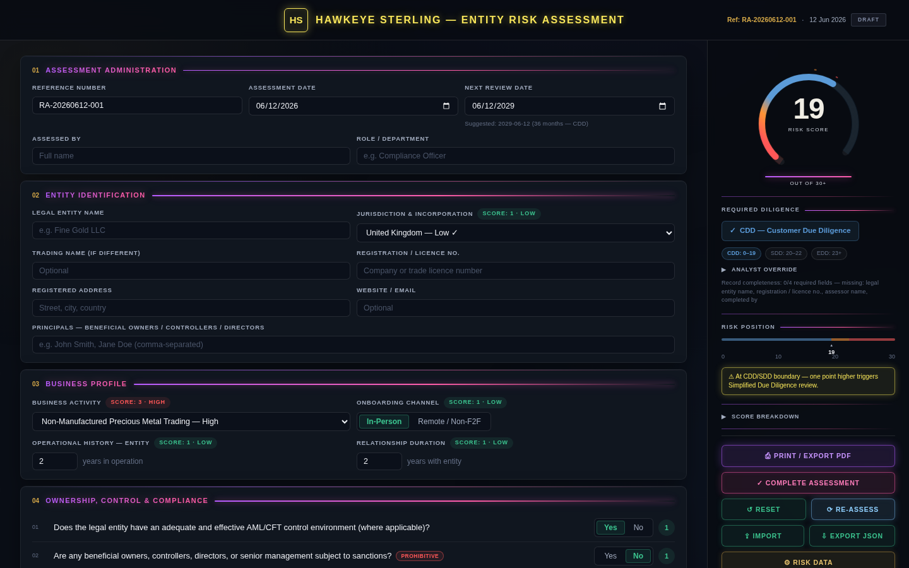
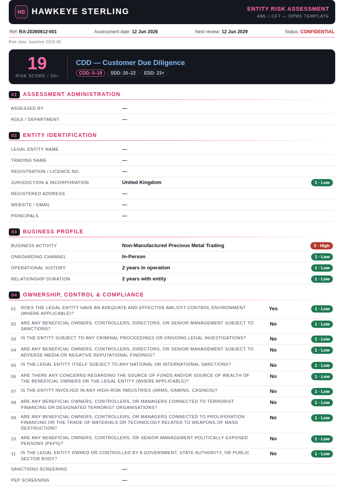

# Hawkeye Sterling — Entity Risk Assessment (RA)

[](https://github.com/trex0092/HAWKEYE-STERLING-RA/actions/workflows/ci.yml)

A single-file web application for **AML/CFT customer (entity) risk assessment**, built as a template for **Dealers in Precious Metals and Stones (DPMS)** and adaptable to other reporting entities.

**Live:** https://hawkeye-sterling-ra.netlify.app

| Assessment form (dark neon UI) | Print report (A4) |
|---|---|
|  |  |

The entire application lives in [`index.html`](index.html) — no build step, no dependencies, no backend. It runs offline, deploys to any static host, and keeps all data on the user's device.

## Features

- **Structured risk scoring** across jurisdiction, business activity, onboarding channel, operational history, relationship duration, ownership/control/compliance questions, and supply-chain material sources (recycled and mined).
- **Risk data maintenance** — a built-in *Risk Data* panel where the compliance officer can override any country, activity, or material score (and the FATF call-for-action flag) on top of the firm-approved baseline. Every override requires a reason, is date-stamped, flags the affected factors in the live breakdown and the printed report, and can be exported/imported as a shared "risk data sheet" file or reset to baseline.
- **Dark neon interface** — six numbered form sections beside a sticky risk-summary sidebar: an animated 270° SVG risk gauge, the required-diligence verdict with threshold chips, a 0–30 risk-position bar, and a collapsible per-factor score breakdown. Entrance and gauge animations respect `prefers-reduced-motion`.
- **Live verdict** — total score, numeric band (CDD / SDD / EDD), and boundary warnings one point below each band edge, recomputed on every change.
- **Hard outcomes** — designated-party exposure (sanctions on the entity or its principals, terrorist financing, proliferation financing) produces a **PROHIBITED — Do Not Onboard** verdict with freeze-and-report instructions; PEP exposure, FATF call-for-action jurisdictions, and the ASM/high-risk-country red flag force **mandatory EDD** regardless of the numeric score. Every escalation is shown with its reason and carried into the export and printed report.
- **Analyst override** — the operative outcome can be raised above the computed one (one-way ratchet: CDD → SDD/EDD, SDD → EDD) with a mandatory justification that prints on the report; it never weakens the computed outcome and never applies to prohibited relationships.
- **Screening evidence** — record the system/provider, date, and reference ID for sanctions, PEP, and adverse-media checks; printed in the report as audit evidence.
- **Assessment metadata** — auto-generated reference (`RA-YYYYMMDD-NNN`), assessment date, assessor name and role.
- **Expanded entity identification** — legal and trading names, registration/licence number, jurisdiction, registered address, website/email, principals (beneficial owners / controllers / directors).
- **Analyst notes & rationale** — free-text section included in the printed report, with a one-click **Narrative Template** that writes a formal, plain-language risk rationale for the matching band (low / medium / high / prohibited), citing the Company's policies by full name (Risk Assessment methodology, Know Your Customer, Risk Appetite Statement, Targeted Financial Sanctions) and filling in the entity, date, and score automatically.
- **FATF Watchdog** — a monthly GitHub Action (`.github/workflows/fatf-watchdog.yml`) reads FATF's published black/grey lists, compares them with the app's country data, and on any change (listed *or* delisted) creates a review task in the RISK ASSESSMENTS Asana project naming the affected assessments. Detection is automatic; score changes remain a human decision via the Risk Data panel. The same monthly run also posts a **"Reviews due"** digest task listing every client whose next review falls due that month (overdue ones flagged), assigned and dated for Asana's reminders. Requires the `ASANA_ACCESS_TOKEN` repository secret.
- **Asana delivery** — marking an assessment *Complete* on the deployed site creates a task in the firm's **RISK ASSESSMENTS** Asana project (task named after the reference, entity, and band; the narrative and result summary in the description) via a Netlify function, so the Asana token never reaches the browser. The task is **filed into a section by risk band** — *LOW RISK (CDD)*, *MEDIUM RISK (SDD)*, *HIGH RISK (EDD)*, *PROHIBITED (DO NOT ONBOARD)* — created on demand, **assigned** (env `ASANA_ASSIGNEE`, default the token owner) with the **due date set to the next review date**, so Asana itself alerts the compliance officer as each review falls due.
- **Assessment register** — every assessment with an entity name files itself into a built-in register (sidebar → *☰ Register*), keyed by its reference: each customer's band, draft/complete status, and next review date at a glance (overdue reviews flagged in red, reviews due within a month in amber), with one-click *Open* to resume any of them and *Delete* to remove a filed copy. Switching never loses work — the current assessment is filed before another is opened — so one browser serves a whole portfolio of entities.
- **Operations robots** — *Site Health* (`.github/workflows/site-health.yml`): every Monday a headless Chrome renders the **live** site and verifies it computes; if it is down or broken, an assigned alert task is opened in Asana. *Auto Release* (`.github/workflows/auto-release.yml`): every merge to `main` that bumps `APP_VERSION` is tagged and released automatically with generated notes. *Risk-data backup*: on every override change the deployed app mirrors the full risk-data sheet to a dedicated Asana task ("RISK DATA SHEET (auto-backup)") via `netlify/functions/risk-backup.js`, and the monthly watchdog commits that mirror to `data/risk-overrides-backup.json` — an off-device backup with a git audit trail.
- **Sign-off & attestation** — first-line (assessed by) and second-line (reviewed & approved, MLRO) blocks with name, title, date, and signature lines under a formal attestation statement, plus an auto-suggested next review date based on the risk band (editable). A *Complete Assessment* toggle tracks draft/complete status.
- **Print-ready report** — a formal black/pink A4 letterhead report (exact-color printing) with the result box, hard-outcome notices, per-factor score chips across every section, notes, attestation, and signature blocks. Use *Print / Export PDF* → save as PDF.
- **Persistence** — drafts autosave to the browser (`localStorage`) and are restored on reload; named assessments are also filed in the on-device register. All dates are entered and displayed as DD/MM/YYYY.
- **Record completeness indicator** in the risk-summary sidebar.

## Risk methodology

### Scored factors

| Factor | Scoring |
|---|---|
| Jurisdiction of incorporation & operation | Per-country score (1 Low / 2 Medium / 3 High) from the embedded country list |
| Nature & complexity of business activities | Per-activity score (Regulated Financial Entities = 1; trading, mining, refining, jewellery, wholesale/pawn = 3) |
| Ownership, control & compliance (11 questions) | Yes = 3, No = 1 — except *AML/CFT control adequacy*, which is inverted (Yes = 1, No = 3) |
| Onboarding channel | In-person = 1, Remote / non-face-to-face = 3 |
| Operational history & relationship duration | < 1 year = 3, 1 year = 2, 2+ years = 1 |
| Supply chain — recycled sources (×3 suppliers) | Per-material score 0–3 (e.g. LBMA Good Delivery = 1, gold-processing chemicals = 3) |
| Supply chain — mined sources (×3 suppliers) | LSM / MSM = 2, ASM (artisanal) = 3, N/A = 0 |

### Numeric risk bands

| Total score | Band | Outcome | Suggested review cycle |
|---|---|---|---|
| 0–19 | **CDD** | Customer Due Diligence | 12 months |
| 20–22 | **SDD** | Simplified Due Diligence review | 6 months |
| 23+ | **EDD** | Enhanced Due Diligence | 3 months |

Review cycles follow the firm's Know Your Customer procedure: low-risk customers are reviewed at least every 12 months, medium-risk every 6 months, and high-risk at least every 3 months with EDD.

### Hard outcomes (override the numeric band)

The numeric score is always displayed unchanged; the operative outcome is layered on top, in strict priority order, with every reason shown in the banner, the JSON export, and the printed report.

**1 · PROHIBITED — Do Not Onboard.** A **Yes** on any designated-party question ends the assessment: do not onboard, freeze funds where held, and file a report with the FIU / relevant authority. No review date is suggested — the relationship is declined.

- Sanctions — beneficial owners, controllers, directors, or senior management
- Sanctions — the legal entity itself
- Terrorist financing connections
- Proliferation financing connections

**2 · Mandatory EDD floor.** When not prohibited, any of the following forces **EDD** regardless of the total score:

| Trigger | Basis |
|---|---|
| PEP exposure = Yes | FATF Recommendation 12 |
| Jurisdiction on the FATF call-for-action list (Iran, North Korea, Myanmar) | FATF public statements |
| Any mined source = ASM **and** jurisdiction risk score 3 | OECD Due Diligence Guidance, Annex II red flag |

**3 ·** Otherwise the numeric band applies.

### Risk data: baseline + overrides

The country/activity/material scores embedded in `index.html` are the **firm-approved baseline** (versioned as `RISK_DATA_VERSION`; changes to it go through a pull request, so git history remains the official audit trail and CI validates every change).

On top of the baseline, the **Risk Data** panel (sidebar → *⚙ Risk Data*) lets the compliance function apply local overrides:

- Change any score (1–3 for countries/activities, 0–3 for materials) or a country's **CFA** (FATF call-for-action) flag — a **reason is mandatory** and the change is date-stamped.
- Overrides are stored as deltas in the browser (`localStorage`) and as a portable **risk data sheet** (JSON export/import), so one approved sheet can be distributed to the whole team.
- Factors affected by an override are marked **✱** in the form, the score breakdown, and the printed report, which also lists each applied override ("Jurisdiction — Hungary: 2 → 3, overridden 12 Jun 2026 — FATF grey-listing") and carries a risk-data version stamp.
- *Reset* removes all overrides. When the firm formally adopts a change, it graduates into the baseline arrays via a PR and the override is retired.

### Analyst override

Separately from the risk data (which is firm-wide), the analyst may raise the operative outcome of a single assessment above the computed one — CDD → SDD/EDD or SDD → EDD — with a mandatory justification. It is a **one-way ratchet**: it can never weaken the computed outcome, is inert without a justification, and never applies to PROHIBITED relationships. The suggested review cadence follows the overridden band, and the report records both the computed and the overridden outcome.

## Data management & privacy

- **Autosave** — the working draft is saved to `localStorage` in the user's browser only; nothing is transmitted anywhere.
- **Print report** — produces an audit-ready PDF via the browser's print dialog. Chrome/Edge/Firefox apply A4 and exact colours automatically; in **Safari**, choose A4 paper size and enable *Print backgrounds* in the print dialog.

## Getting started

**Open directly** — download `index.html` and open it in any modern browser.

**Serve locally:**

```bash
python3 -m http.server 8000
# → http://localhost:8000
```

**Deploy** — the Netlify project [`hawkeye-sterling-ra`](https://app.netlify.com/projects/hawkeye-sterling-ra) publishes the repo root as-is (`netlify.toml`, no build step). Link the repository to the project in the Netlify UI for continuous deploys, or deploy any other static host — the app is a single `index.html`.

## Tests

The scoring engine, hard-outcome escalations, persistence, and report rendering are covered by a dependency-free test suite that executes the app's full inline script against a DOM stub:

```bash
node test/app.test.js        # 187 checks — engine, register, report, Asana delivery & backup
node test/watchdog.test.mjs  # 16 checks — FATF list parsing, alerts, digest, backup extraction
```

CI runs both suites plus a headless-Chrome smoke test (renders `index.html`, asserts the computed verdict and gauge) on every push and pull request (`.github/workflows/ci.yml`).

## Project structure

```
.
├── index.html                  # The complete application (markup, styles, data, logic)
├── test/app.test.js            # Functional test suite (no dependencies)
├── test/watchdog.test.mjs      # FATF watchdog unit tests
├── scripts/fatf-watchdog.mjs   # Monthly FATF black/grey list watchdog (Asana alerts)
├── data/fatf-state.json        # Watchdog's last-seen FATF lists (committed by the action)
├── .github/workflows/          # CI, FATF watchdog + digest + backup, site health, releases
├── scripts/asana-alert.mjs     # Asana alert task helper (used by site health)
├── netlify.toml                # Static publish config (repo root, no build)
├── netlify/functions/          # Serverless: Asana task delivery + risk-data mirror
├── docs/                       # README screenshots
├── design/                     # Original design handoff (reference only, not served logic)
└── README.md
```

## Disclaimer

This tool is for **internal compliance use only**. It supports — and does not replace — professional judgement, firm policy, and applicable AML/CFT regulatory obligations. Country, activity, and material risk scores are template values sourced from the firm's risk data sheet and should be reviewed and maintained by the compliance function.
