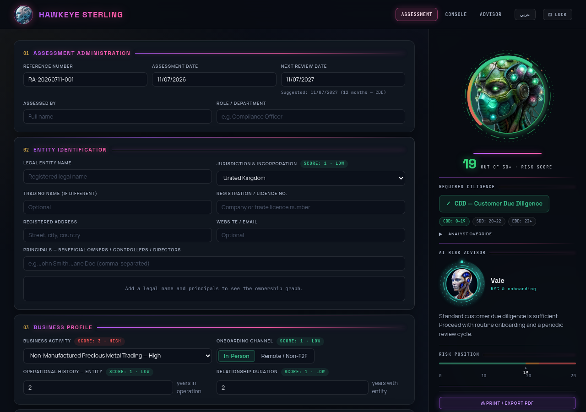
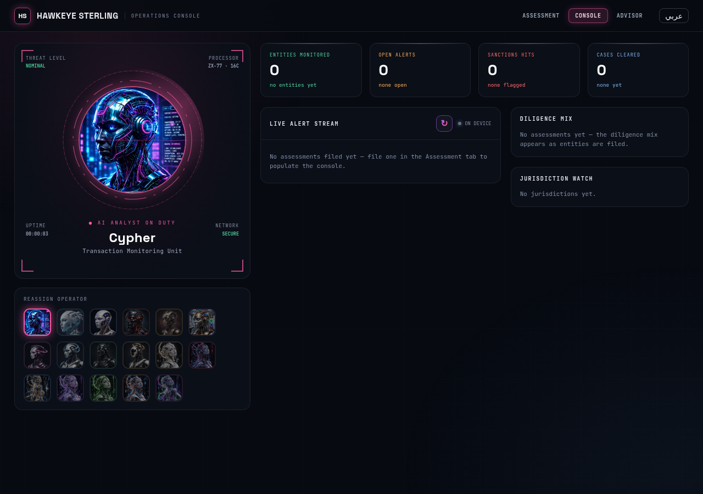
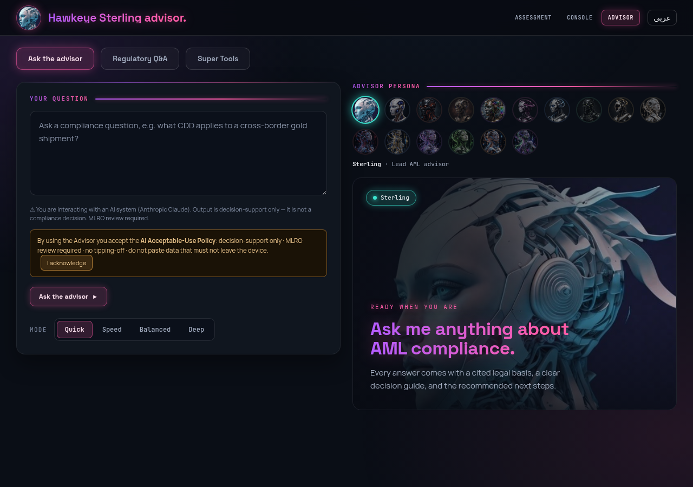

# Hawkeye Sterling - Entity Risk Assessment (RA)

**Project:** [Contributing](CONTRIBUTING.md) · [Code of Conduct](CODE_OF_CONDUCT.md) · [Security](SECURITY.md) · [License](LICENSE) · [Support](SUPPORT.md) · [Governance](GOVERNANCE.md) · [Maintainers](MAINTAINERS.md)

**Technical & compliance:** [Architecture](docs/architecture/README.md) · [Compliance Methodology](docs/policies/README.md) · [Screening Coverage](data/screening-country-coverage.json) · [Data Sources](data/sanctions-sources.json) · [Controls](data/controls/README.md) · [Operations](docs/operations/README.md) · [Changelog](CHANGELOG.md) · [Citation](docs/research/README.md) · [Docs index](docs/README.md)

<!-- Runtime assurance badges are intentionally neutral on the default branch.
     The live screening status is tracked by workflow evidence rather than a stale
     branch artifact. -->
[](https://github.com/trex0092/HAWKEYE-STERLING-RA/actions/workflows/screening-assurance.yml)
[](https://github.com/trex0092/HAWKEYE-STERLING-RA/actions/workflows/screening-assurance.yml)
[](https://github.com/trex0092/HAWKEYE-STERLING-RA/actions/workflows/screening-assurance.yml)
[](https://github.com/trex0092/HAWKEYE-STERLING-RA/actions/workflows/screening-assurance.yml)

<!-- Configured scope: generated from the engine's own configuration by scripts/coverage-figures.mjs, CI drift-checked.
     These badges describe intended geographic applicability, not proof that a particular run succeeded. -->
[](data/screening-country-coverage.json)
[](data/screening-country-coverage.json)
[](data/screening-country-coverage.json)

**Worldwide screening scope:** the configured sanctions, adverse-media and PEP controls apply to the full 195-country subject universe. Runtime operational status is reported separately above from the actual daily-screen evidence. Dedicated national sanctions sources and dedicated Google News editions are depth metrics shown below.

[](data/screening-country-coverage.json)
[](data/screening-country-coverage.json)
[](data/screening-country-coverage.json)
[](data/screening-country-coverage.json)
[](data/screening-country-coverage.json)
[](data/screening-country-coverage.json)
[](scripts/adverse-media.mjs)
[](screen.py)
[](https://github.com/trex0092/HAWKEYE-STERLING-RA/actions/workflows/pep-worldwide.yml)
[](https://github.com/trex0092/HAWKEYE-STERLING-RA/actions/workflows/pep-chain-watchdog.yml)
[](https://github.com/trex0092/HAWKEYE-STERLING-RA/actions/workflows/eocn-reconcile.yml)

[](https://github.com/trex0092/HAWKEYE-STERLING-RA/actions/workflows/ci.yml)
[](https://github.com/trex0092/HAWKEYE-STERLING-RA/actions/workflows/codeql.yml)
[](https://github.com/trex0092/HAWKEYE-STERLING-RA/actions/workflows/weekly-adverse-media.yml)
[](https://github.com/trex0092/HAWKEYE-STERLING-RA/actions/workflows/freshness-check.yml)
[](https://scorecard.dev/viewer/?uri=github.com/trex0092/HAWKEYE-STERLING-RA)
[](https://github.com/trex0092/HAWKEYE-STERLING-RA/releases)
[](https://app.netlify.com/projects/hawkeye-sterling-ra/deploys)
[](LICENSE)

<!-- Code quality & security gates (push/PR + scheduled) -->
[](https://github.com/trex0092/HAWKEYE-STERLING-RA/actions/workflows/lint.yml)
[](https://github.com/trex0092/HAWKEYE-STERLING-RA/actions/workflows/semgrep.yml)
[](https://github.com/trex0092/HAWKEYE-STERLING-RA/actions/workflows/gitleaks.yml)
[](https://github.com/trex0092/HAWKEYE-STERLING-RA/actions/workflows/osv-scanner.yml)
[](https://github.com/trex0092/HAWKEYE-STERLING-RA/actions/workflows/workflow-lint.yml)
[](https://github.com/trex0092/HAWKEYE-STERLING-RA/actions/workflows/dast-zap.yml)
[](https://github.com/trex0092/HAWKEYE-STERLING-RA/actions/workflows/a11y.yml)
[](https://github.com/trex0092/HAWKEYE-STERLING-RA/actions/workflows/cross-browser.yml)
[](https://github.com/trex0092/HAWKEYE-STERLING-RA/actions/workflows/visual.yml)
[](https://github.com/trex0092/HAWKEYE-STERLING-RA/actions/workflows/docker-smoke.yml)
[](https://github.com/trex0092/HAWKEYE-STERLING-RA/actions/workflows/container-scan.yml)
[](https://github.com/trex0092/HAWKEYE-STERLING-RA/actions/workflows/attestation-verify.yml)
[](https://github.com/trex0092/HAWKEYE-STERLING-RA/actions/workflows/bandit.yml)
[](https://github.com/trex0092/HAWKEYE-STERLING-RA/actions/workflows/fortify.yml)
[](https://github.com/trex0092/HAWKEYE-STERLING-RA/actions/workflows/dependency-review.yml)
[](https://github.com/trex0092/HAWKEYE-STERLING-RA/actions/workflows/lighthouse.yml)
[](https://github.com/trex0092/HAWKEYE-STERLING-RA/actions/workflows/scorecard.yml)

<!-- Live compliance controls (scheduled watchers - a red badge IS the alarm) -->
[](https://github.com/trex0092/HAWKEYE-STERLING-RA/actions/workflows/regulatory-watch.yml)
[](https://github.com/trex0092/HAWKEYE-STERLING-RA/actions/workflows/fatf-watchdog.yml)
[](https://github.com/trex0092/HAWKEYE-STERLING-RA/actions/workflows/sanctions-watch.yml)
[](https://github.com/trex0092/HAWKEYE-STERLING-RA/actions/workflows/link-check.yml)
[](https://github.com/trex0092/HAWKEYE-STERLING-RA/actions/workflows/site-health.yml)
[](https://github.com/trex0092/HAWKEYE-STERLING-RA/actions/workflows/function-health.yml)
[](https://github.com/trex0092/HAWKEYE-STERLING-RA/actions/workflows/site-currency.yml)
[](https://github.com/trex0092/HAWKEYE-STERLING-RA/actions/workflows/delivery-watchdog.yml)
[](https://github.com/trex0092/HAWKEYE-STERLING-RA/actions/workflows/control-retry.yml)
[](https://github.com/trex0092/HAWKEYE-STERLING-RA/actions/workflows/netlify-production-deploy.yml)

<!-- Scheduled ops, reporting & AI assurance (live workflow status) -->
[](https://github.com/trex0092/HAWKEYE-STERLING-RA/actions/workflows/anomaly-watch.yml)
[](https://github.com/trex0092/HAWKEYE-STERLING-RA/actions/workflows/daily-brief.yml)
[](https://github.com/trex0092/HAWKEYE-STERLING-RA/actions/workflows/weekly-summary.yml)
[](https://github.com/trex0092/HAWKEYE-STERLING-RA/actions/workflows/governance-report.yml)
[](https://github.com/trex0092/HAWKEYE-STERLING-RA/actions/workflows/quarterly-review.yml)
[](https://github.com/trex0092/HAWKEYE-STERLING-RA/actions/workflows/onboarding-screen.yml)
[](https://github.com/trex0092/HAWKEYE-STERLING-RA/actions/workflows/compliance-calendar.yml)
[](https://github.com/trex0092/HAWKEYE-STERLING-RA/actions/workflows/asana-reconcile.yml)
[](https://github.com/trex0092/HAWKEYE-STERLING-RA/actions/workflows/advisor-eval.yml)
[](https://github.com/trex0092/HAWKEYE-STERLING-RA/actions/workflows/advisor-bias-eval.yml)
[](https://github.com/trex0092/HAWKEYE-STERLING-RA/actions/workflows/publish-container.yml)
[](https://github.com/trex0092/HAWKEYE-STERLING-RA/actions/workflows/stale.yml)

<!-- Live site scans (external, continuous) -->
[](https://developer.mozilla.org/en-US/observatory/analyze?host=hawkeye-sterling-ra.netlify.app)
[](https://hawkeye-sterling-ra.netlify.app)

<!-- Estate counts (dynamic - read from drift-guarded committed data, never hand-counted) -->
[](data/board-figures.json)
[](data/board-figures.json)
[](data/board-figures.json)
[](data/reg-sources.json)
[](data/sanctions-sources.json)

<!-- Repository stats (live) -->
[](https://github.com/trex0092/HAWKEYE-STERLING-RA/commits/main)
[](https://github.com/trex0092/HAWKEYE-STERLING-RA/graphs/commit-activity)
[](https://github.com/trex0092/HAWKEYE-STERLING-RA/graphs/contributors)
[](https://github.com/trex0092/HAWKEYE-STERLING-RA/issues)
[](https://github.com/trex0092/HAWKEYE-STERLING-RA/pulls)
[](https://github.com/trex0092/HAWKEYE-STERLING-RA)
[](https://github.com/trex0092/HAWKEYE-STERLING-RA)
[](https://github.com/trex0092/HAWKEYE-STERLING-RA/releases)

<!-- Platform & posture facts (static) -->
[](package.json)
[](pyproject.toml)
[](sw.js)
[](package.json)
[](Dockerfile)
[](netlify.toml)
[](sw-register.js)
[](test/axe.spec.mjs)
[](i18n.js)
[](CODE_OF_CONDUCT.md)
[](docs/governance/README.md)
[](.github/dependabot.yml)

A static web application for **AML/CFT customer (entity) risk assessment**, built as a template for **Dealers in Precious Metals and Stones (DPMS)** and adaptable to other reporting entities.

**Live:** https://hawkeye-sterling-ra.netlify.app

The core application lives in [`index.html`](index.html) with its logic in the sibling [`app.js`](app.js) and styles in [`app.css`](app.css) - no build step, no backend, no bundler. Page logic and scaffold maintenance reside in the repo as documented in the project structure below.

## Contents

- [The command-center suite](#the-command-center-suite)
- [Screenshots](#screenshots)
- [Features](#features)
- [Automated daily screening engine + AI layer](#automated-daily-screening-engine--ai-layer)
- [MCP server (AI-agent access to the engine)](#mcp-server-ai-agent-access-to-the-engine)
- [Risk methodology](#risk-methodology)
- [Data management & privacy](#data-management--privacy)
- [Device security](#device-security)
- [Setup](#setup)
- [Tests](#tests)
- [Accessibility](#accessibility)
- [Project structure](#project-structure)
- [System state & known limitations](#system-state--known-limitations)
- [Contributing & support](#contributing--support)
- [Security](#security)
- [License](#license)
- [Disclaimer](#disclaimer)

## The command-center suite

A dark neon, AI-persona "command center" spanning three sibling pages - pure HTML/CSS/JS, no framework, cross-linked from the header nav and sharing the six robot portraits in [`assets/`](assets).

| Page | File | Purpose |
|---|---|---|
| **Entity Risk Assessment** | [`index.html`](index.html) | The primary tool - live 0–30 risk scoring, animated gauge, CDD/SDD/EDD verdict, analyst override, Risk-Data editor, register and activity logging. |
| **AI Operations Console** | [`console.html`](console.html) | A live monitoring HUD - a robot "analyst on duty" inside an animated radar, an operator switcher, count-up stat tiles, a live alert feed, and a command board. |
| **Hawkeye Sterling Advisor** | [`advisor.html`](advisor.html) | A cited-answer AML Q&A - a question composer with a swappable AI persona that returns a verdict, cited legal basis, decision guidance and a policy-relevant summary. |

The **AI Risk Advisor** in the assessment sidebar is a robot whose head and HUD colour follow the operative outcome - **Vale** (teal) for CDD, **Cypher** (amber) for SDD, **Ember** (red) for EDD.

## Screenshots

Desktop captures of the three screens (Chromium, 1280×900 - sources in [`docs/screenshots/`](docs/screenshots)):

| Entity Risk Assessment | AI Operations Console | Hawkeye Sterling Advisor |
|---|---|---|
| [](docs/screenshots/index.png) | [](docs/screenshots/console.png) | [](docs/screenshots/advisor.png) |

## Features

- **Structured risk scoring** across jurisdiction, business activity, onboarding channel, operational history, relationship duration, ownership/control/compliance questions, and supply-chain materials.
- **Risk data maintenance** - a built-in *Risk Data* panel where the compliance officer can override any country, activity, or material score (and the FATF call-for-action flag) on top of the firm baseline.
- **Dark neon interface** - six numbered form sections beside a sticky risk-summary sidebar: an animated 270° SVG risk gauge, the required-diligence verdict with threshold chips, a 0–30 risk-position track and the breakdowns.
- **Live verdict** - total score, numeric band (CDD / SDD / EDD), and boundary warnings one point below each band edge, recomputed on every change.
- **Hard outcomes** - designated-party exposure (sanctions on the entity or its principals, terrorist financing, proliferation financing) produces a **PROHIBITED - Do Not Onboard** verdict with formal reporting consequences.
- **Analyst override** - the operative outcome can be raised above the computed one (one-way ratchet: CDD → SDD/EDD, SDD → EDD) with a mandatory justification that prints on the report.
- **Screening evidence** - record the system/provider, date, and reference ID for sanctions, PEP, and adverse-media checks; printed in the report as audit evidence.
- **Assessment metadata** - auto-generated reference (`RA-YYYYMMDD-NNN`), assessment date, assessor name and role.
- **Expanded entity identification** - legal and trading names, registration/licence number, jurisdiction, registered address, website/email, principals (beneficial owners / controllers / directors) and notes.
- **Analyst notes & rationale** - free-text section included in the printed report, with a one-click **Narrative Template** that writes a formal, plain-language risk rationale.
- **FATF Watchdog** - a monthly GitHub Action reads FATF's published black/grey lists, compares them with the app's country data, and raises alerts on change.
- **Regulatory Watch** - a weekly GitHub Action monitors a worldwide, UAE-weighted set of regulatory sources.
- **Sanctions Watch** - a daily GitHub Action fingerprints major designation lists and tracks changes over time.
- **Sanctions Screen** - a daily GitHub Action answers the operative question: *"is any of our customers now on a list?"*.
- **Screening accuracy benchmark (95% floors, CI-enforced)** - screening quality is measured, not asserted.
- **Asana delivery** - marking an assessment *Complete* on the deployed site creates a task in the firm's **RISK ASSESSMENTS** Asana project.
- **Assessment register** - every assessment with an entity name files itself into a built-in register keyed by reference.
- **Operations robots** - *Site Health*, *Function Health*, *Control Retry* and associated watchdogs verify live site behaviour and operational continuity.
- **Sign-off & attestation** - first-line and second-line review blocks with name, title, date and signature lines under a formal attestation statement.
- **Print-ready report** - a formal black/pink A4 letterhead report with result box, notes and sign-off blocks.
- **Persistence** - drafts autosave to `localStorage` and are restored on reload.
- **Record completeness indicator** in the risk-summary sidebar.

## Automated daily screening engine + AI layer

Beyond the on-device assessment tool, the repository runs an automated, audit-grade daily screening engine over the firm's live customer base, augmented by a governance-first AI layer.

## MCP server (AI-agent access to the engine)

A Model Context Protocol server exposes the deterministic screening engine as tools, resources and prompts for AI agents.

## Risk methodology

### Scored factors

| Factor | Scoring |
|---|---|
| Jurisdiction of incorporation & operation | Per-country score (1 Low / 2 Medium / 3 High) from the embedded country list |
| Nature & complexity of business activities | Per-activity score (Regulated Financial Entities = 1; trading, mining, refining, jewellery, wholesale/pawn = 3) |
| Ownership, control & compliance (11 questions) | Yes = 3, No = 1 - except *AML/CFT control adequacy*, which is inverted (Yes = 1, No = 3) |
| Onboarding channel | In-person = 1, Remote / non-face-to-face = 3 |
| Operational history & relationship duration | < 1 year = 3, 1 year = 2, 2+ years = 1 |
| Supply chain - recycled sources (×3 suppliers) | Per-material score 0–3 |
| Supply chain - mined sources (×3 suppliers) | LSM / MSM = 2, ASM (artisanal) = 3, N/A = 0 |

### Numeric risk bands

| Total score | Band | Outcome | Suggested review cycle |
|---|---|---|---|
| 0–19 | **CDD** | Customer Due Diligence | 12 months |
| 20–22 | **SDD** | Simplified Due Diligence review | 6 months |
| 23+ | **EDD** | Enhanced Due Diligence | 3 months |

## Data management & privacy

- **Autosave** - the working draft is saved to `localStorage` in the user's browser only.
- **Print report** - produces an audit-ready PDF via the browser's print dialog.

## Device security

For an offline, zero-backend tool, sensitive data is protected **on the device** rather than behind a server.

## Setup

### Asana integration

Copy `.env.example` to `.env` and fill in the values, then add them to your hosting environment.

### Getting started

**Open directly** - download `index.html` and open it in any modern browser.

**Serve locally:**

```bash
python3 -m http.server 8000
# → http://localhost:8000
```

**Deploy** - the Netlify project publishes the repo root as-is (`netlify.toml`, no build step).

## Tests

The scoring engine, hard-outcome escalations, persistence, and report rendering are covered by a dependency-free test suite.

## Accessibility

The application targets WCAG 2.1 Level AA for its core assessment workflow.

**Known limitations:** some badge colours have not been independently audited.

## Project structure

```text
.
├── index.html
├── app.js
├── app.css
├── console.html
├── advisor.html
├── docs/
├── data/
├── scripts/
├── test/
├── .github/workflows/
├── netlify.toml
├── package.json
├── README.md
└── LICENSE
```

## System state & known limitations

- **Transaction monitoring is built and inert.** The FATF R.16 rules engine is implemented and unit-tested but inactive until a transaction feed is connected.
- **Part of the policy pack is draft.** Some procedures remain pending approval.
- **Function endpoints are effectively public by design.** A static browser app cannot keep a real secret; origin and shared-token checks deter but do not authenticate.
- **Assessments persist on-device only** (`localStorage`).
- **The LLM layer ships disabled.** Every LLM path is fail-closed behind `ANTHROPIC_API_KEY` plus explicit opt-in.
- **Alert delivery is Asana-only.** Delivery failure fails the run loudly.
- **Arabic coverage is partial.** The assessment screen is fully translated; console/advisor carry minimal AR chrome.

## Contributing & support

- **Contributing:** see [`CONTRIBUTING.md`](CONTRIBUTING.md) for the test suite, branch/commit conventions, and PR gates.
- **Community standards:** [`CODE_OF_CONDUCT.md`](CODE_OF_CONDUCT.md).
- **Getting help:** [`SUPPORT.md`](SUPPORT.md), or open an issue with the templates in [`.github/ISSUE_TEMPLATE`](.github/ISSUE_TEMPLATE).

## Security

Found a vulnerability? **Do not open a public issue** - follow the disclosure process in [`SECURITY.md`](SECURITY.md).

## License

**Proprietary - All Rights Reserved.** See [`LICENSE`](LICENSE).

## Disclaimer

This tool is for **internal compliance use only**. It supports, and does not replace, professional judgement, firm policy and applicable AML/CFT obligations.
