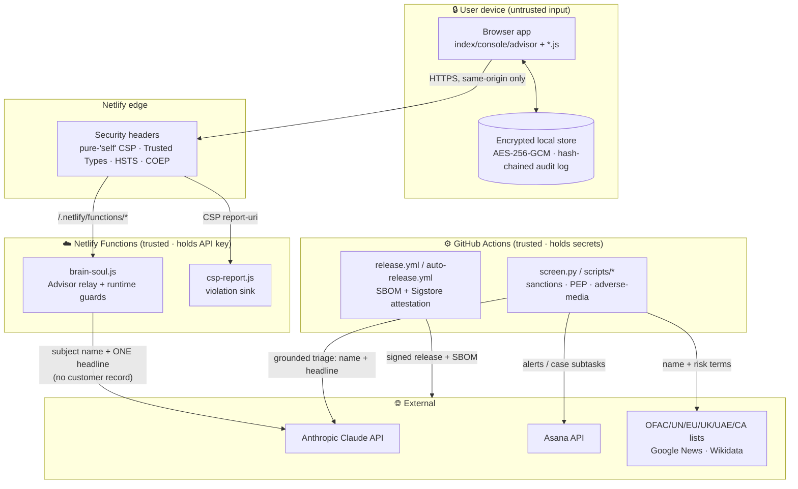

# Architecture & Data-Flow

A single reference for how Hawkeye Sterling RA is wired, where the **trust
boundaries** sit, and what crosses each one. It complements the red-team procedure
([`docs/aims/red-team-procedure.md`](aims/red-team-procedure.md)), the AI system
inventory ([`docs/aims/ai-system-inventory.md`](aims/ai-system-inventory.md)), and
the security policy ([`../SECURITY.md`](../SECURITY.md)).

## Components

| Tier | Component | Runs where | Holds secrets? |
|---|---|---|---|
| Browser (untrusted) | `index.html` / `console.html` / `advisor.html` + `app.js` / `console.js` / `advisor.js` / `i18n.js` / `sw.js` | User's device | No — data encrypted at rest (AES-256-GCM), passphrase-gated |
| Edge | Netlify CDN + security headers (`netlify.toml`) | Netlify edge | No |
| Serverless (trusted) | `netlify/functions/brain-soul.js` (AI Advisor relay), `csp-report.js` | Netlify Functions | **Yes** — `ANTHROPIC_API_KEY` |
| Automation (trusted) | GitHub Actions watchers + `scripts/*` (sanctions, PEP, adverse-media, screening, release) | GitHub-hosted runners | **Yes** — `ANTHROPIC_API_KEY`, `ASANA_ACCESS_TOKEN` |
| External processors | Anthropic Claude API, Asana API | Third-party | n/a (data-minimised egress) |
| External sources (read-only) | OFAC/UN/EU/UK/UAE/Canada lists, Google News RSS, Wikidata | Public | n/a |

## Data-flow diagram

Trust boundaries are drawn as subgraphs; every arrow that crosses a boundary is a
control point.

## What crosses each boundary (and the control)

| Boundary crossed | Data | Control |
|---|---|---|
| Browser → Edge | Assessment inputs, Advisor questions | Pure-`'self'` CSP + Trusted Types; HTTPS/HSTS; no third-party origins |
| Edge → Function | Advisor question | CORS origin guard; server holds the key; kill switch (`ADVISOR_ENABLED`) |
| Function → Anthropic | Subject name + a single headline | **Data-minimised** — never the customer record; key-off ⇒ no egress; errors not reflected to client |
| Actions → external lists | Subject name + risk terms | Public read-only feeds; harden-runner egress policy; least-privilege `permissions:` |
| Actions → Asana | Alerts, case subtasks | Server-held token; scoped automation |
| Release → public | Source tarball + SBOM | **Sigstore-keyless build-provenance attestation** (`gh attestation verify`) |

## Threat model (STRIDE per boundary)

A lightweight STRIDE pass; full attack scenarios live in the red-team procedure.

| Threat | Where it applies | Mitigation in place |
|---|---|---|
| **S**poofing | Edge → Function; Actions → APIs | Same-origin CORS guard; server-held keys/tokens; OIDC for releases |
| **T**ampering | Browser store; CI artifacts | Hash-chained tamper-evident audit log; AES-256-GCM at rest; SBOM + build-provenance attestation; SHA-pinned Actions |
| **R**epudiation | Assessments, AI advice | Audit line "decision support, not a decision — MLRO review"; git + Asana trails; immutable audit chain |
| **I**nformation disclosure | Function → Anthropic; client code | Data-minimised egress; secrets never reach the browser (enforced by Semgrep `hawkeye-no-secret-read-in-client`); upstream error bodies not reflected |
| **D**enial of service | Function; watchers | Budget flag + timeouts; deterministic fallback on model failure; degrade-loudly alerting |
| **E**levation of privilege | DOM-XSS; CI | Trusted Types (`createScript` throws) + `require-trusted-types-for 'script'`; no `eval`/`new Function` (Semgrep `hawkeye-no-string-to-code`); least-privilege workflow permissions |

## Key design decisions (rationale)

- **Zero runtime dependencies / no build step** — minimises supply-chain surface;
  the meaningful supply chain is documented in the SBOM (`scripts/gen-sbom.mjs`).
- **Deterministic engine is the system of record** — the LLM only sharpens
  outputs; every AI surface is decision-support with a human in the loop.
- **No licensed PEP/sanctions feed** — Wikidata/official public lists are used as a
  best-effort $0 signal; this is a documented limitation, not a hidden assumption.
