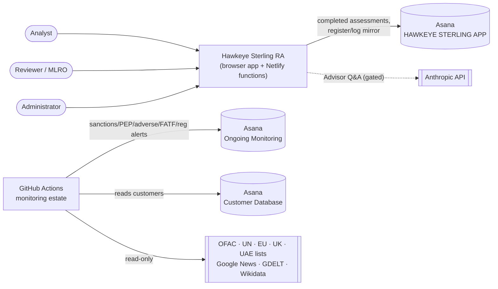
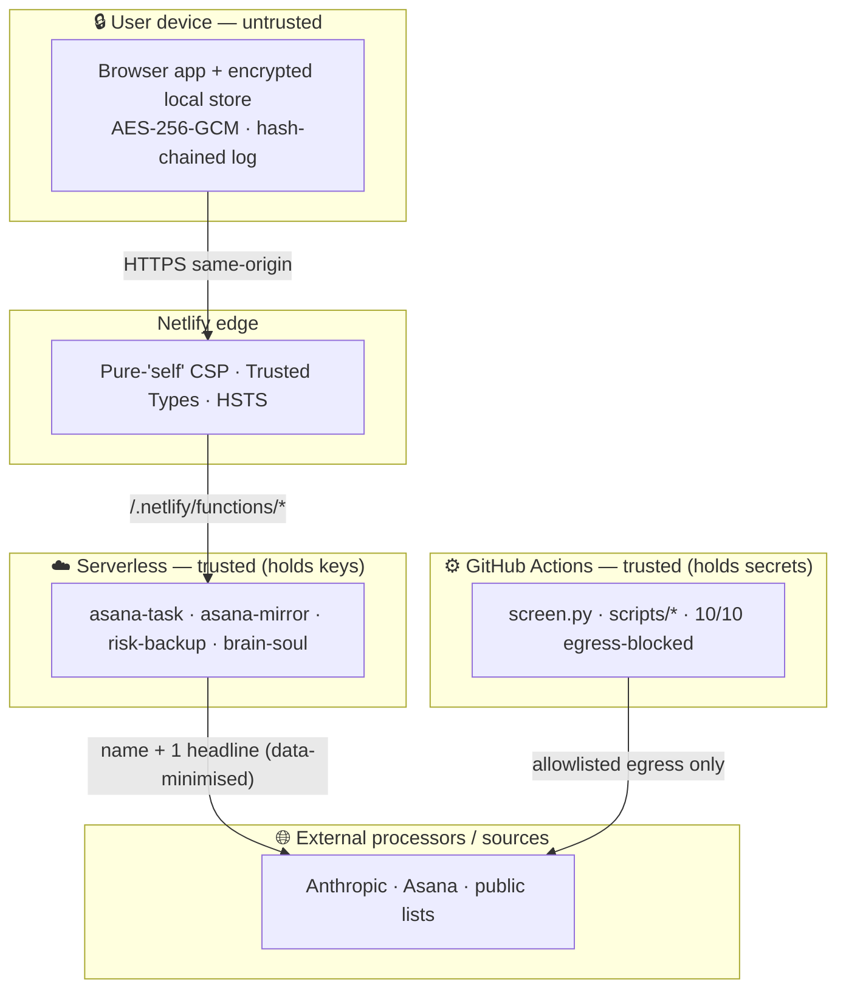
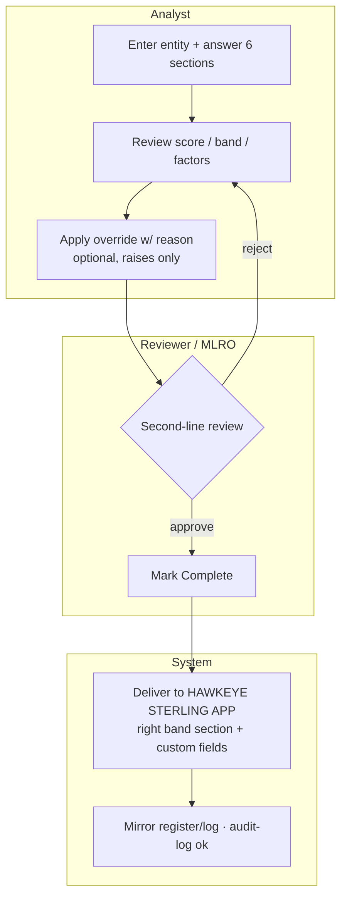
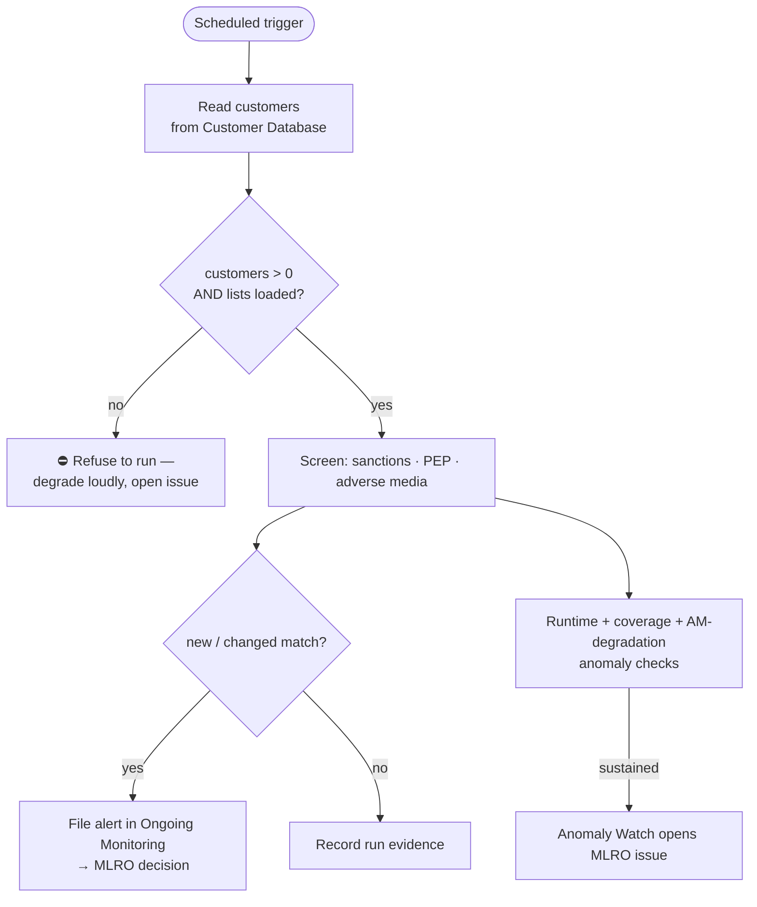
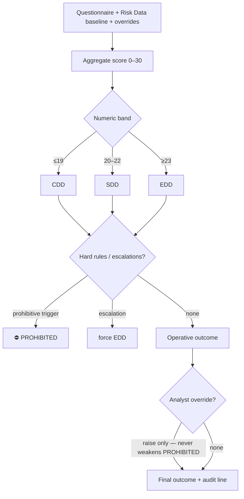
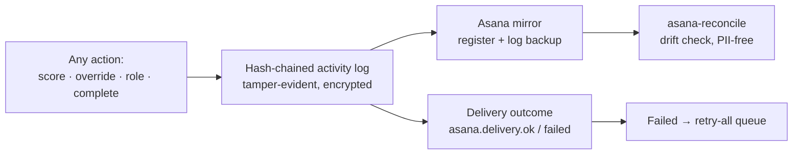
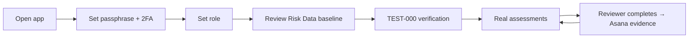

# Architecture Diagrams

Enterprise diagram set (Mermaid — renders natively on GitHub, no tooling). These
complement the narrative and the data-flow / trust-boundary / STRIDE analysis in
[`../architecture.md`](../architecture.md). Date: 2 Jul 2026.

Index: [System Context](#1-system-context) · [Trust Boundaries](#2-trust-boundaries) ·
[Risk-Assessment Workflow](#3-risk-assessment-workflow-swimlane) ·
[Screening / Compliance Workflow](#4-screening--compliance-workflow) ·
[Scoring Decision Flow](#5-scoring-decision-flow) · [Audit-Trail Flow](#6-audit-trail-flow) ·
[User Journey](#7-user-journey).

## 1 · System Context
Who and what the platform talks to.

## 2 · Trust Boundaries
Every arrow that crosses a box is a control point (full control table in `architecture.md`).

## 3 · Risk-Assessment Workflow (swimlane)
Who does what, from draft to filed evidence.

## 4 · Screening / Compliance Workflow
The daily automated control loop.

## 5 · Scoring Decision Flow
How inputs become an operative outcome (deterministic).

## 6 · Audit-Trail Flow
Why every action is defensible.

## 7 · User Journey (first-run → steady state)

*Diagrams describe the system as implemented at the date above; keep them in step
with `architecture.md` and the model cards when the design changes.*
