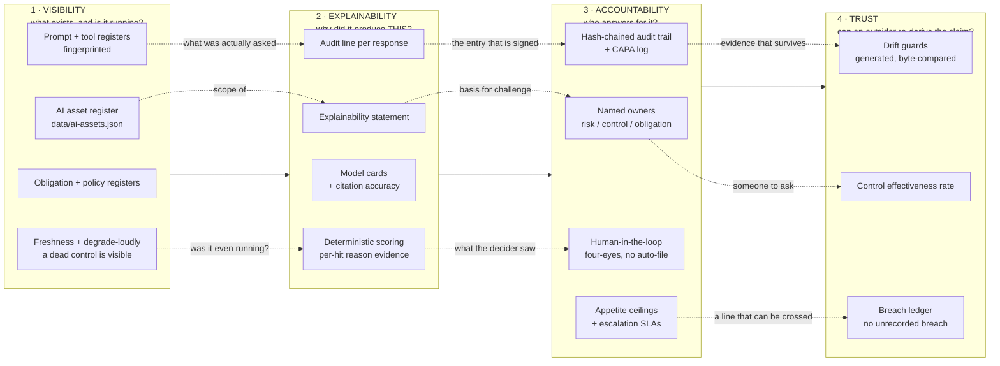

# The Governance Chain — Visibility → Explainability → Accountability → Trust

**Owner:** MLRO · Compliance Engineering
**Review:** annually, and whenever a control in the chain is added, retired or
changes owner.
**Related:** [`assurance-coverage-matrix.md`](assurance-coverage-matrix.md) (control → *proof*) ·
[`../AI-GOVERNANCE.md`](../AI-GOVERNANCE.md) §8a (pillar → *control*) ·
[`grc-metrics.md`](grc-metrics.md) (control → *number*)

The estate slices its governance four different ways — a five-level stack, a
six-layer agentic model, a seven-stage lifecycle, an eleven-stage PbG map — and
every one of them is a slicing of the *same territory*. What none of them draws
is the **dependency between controls**: which control's output another control
consumes, and therefore what breaks downstream when one of them stops working.

That is what this page is. It is not a fifth taxonomy. Its only claim is an
ordering, and the ordering is load-bearing:

> **You cannot explain what you cannot see. You cannot hold anyone accountable
> for a decision you cannot explain. And trust is not something you assert — it
> is what is left over when the first three hold and can be checked by someone
> who does not work here.**

---

## 1. The chain

## 2. Failure propagation — the reason the ordering matters

A break does not stay where it happens. Each row is a real dependency in this
repository, not an abstraction.

| Break | Immediate effect | What it silently voids downstream |
|---|---|---|
| **AI asset register goes stale** (a feature ships unregistered) | One asset undocumented | The [explainability statement](explainability-statement-2026.md) claims to describe *the AI features*. Its **scope claim** is now false — not wrong about what it covers, but wrong about what there is. Every accountability record built on it is therefore about a system that is not the one running. **This is why the register is fingerprinted and CI-compared** |
| **Prompt fingerprint drifts** | Production behaves differently from the reviewed instruction set | The audit line per response still says what the response *was*, but no longer supports *why* — the reviewed prompt is not the prompt that ran. The four-eyes record then attests to a decision made on evidence nobody reviewed. Caught by `governanceDriftCount` (KRI-05, threshold 0) |
| **A control stops running silently** | Nothing appears to be wrong — the most dangerous shape of failure | A clean-looking result is indistinguishable from a real one. Explainability answers *why this output* and gets the honest answer "because nothing ran", which is precisely the answer a silent failure hides. **This is the whole reason for degrade-loudly and STALE flags**: not to fix the failure, but to keep it visible enough to be explained |
| **A control has no named owner** | Governance reads fine on paper | There is nobody to escalate to, so the escalation SLA has no recipient, so the breach ledger has no entry, so the trust indicators cannot distinguish "no breach" from "nobody recorded one". Pinned by `obligationsWithoutOwner` (KRI-02, threshold 0) |
| **A residual sits above appetite with no dated treatment** | A known risk is carried | Accountability is asserted but unbounded — a risk with no ceiling can never be *breached*, so it is never escalated, so no one is ever accountable for still carrying it. This is exactly the condition `residualAboveAppetite` now measures, and it currently reports **1** (R-03) |
| **A generated artefact is hand-edited** | One number becomes convenient | Trust collapses at the last link: a figure in a board pack no longer traces to a commit. Every quoted metric would have to be taken on the word of whoever typed it — which is the state this whole estate is built to avoid. Pinned by three byte-comparing drift guards |

**Read the table upward and it is a diagnostic.** A trust indicator that will not
hold is rarely a trust problem: it is an accountability gap, which is usually an
explainability gap, which is almost always a visibility gap. Fix at the lowest
broken link; repairing a higher one leaves the failure intact and hides it
better.

## 3. Trust, defined so it can be measured

Trust is the vaguest word in governance and usually the least falsifiable — in
this repository, before this page, the only occurrences of *trust* were security
**trust boundaries**, **Trusted Types**, and a tagline. So it is defined here
narrowly and operationally:

> **Trust is the share of what this estate claims that an outsider can
> re-derive from the repository without asking anyone who works here.**

Not *"people believe us"*. Not an absence of problems. It is a property of the
evidence, so it can be indicated by numbers that already exist:

| Indicator | Reads | Source | What a fall would mean |
|---|---|---|---|
| **Control effectiveness rate** | **100%** (61/61) | `data/grc-metrics.json` | A control the firm claims no longer points at a proof that exists. A claim without a check is an assertion |
| **Recorded-breach completeness** | **100%** — every breached KRI appears in the [breach ledger](kri-breach-ledger.md) with a follow-up, CI-enforced | `test/grc-metrics.test.mjs` | A breach the dashboard shows and the record does not. **Trust is not the absence of breaches — it is the absence of *unrecorded* ones** |
| **Generated-artefact integrity** | **3 drift guards** — `grc-metrics` and `reg-sources-doc` via `--check` (whole-file comparison), `board-figures` via its own suite (per-figure) | `scripts/run-tests.mjs`, `test/board-figures.test.mjs` | A quoted figure could go stale, or be hand-edited, without the build noticing |
| **Honest nulls** | KRI-09 reports **null with its reason**, never 0% | `data/grc-metrics.json` | A metric that cannot be computed reported as passing. **Reporting an uncomputable metric as green costs more trust than reporting it as null** |

Two of these indicators are deliberately *not* "everything is green":
`residualAboveAppetite` reports 1 and `kriBreachRate` reports 22.2%. An estate
whose indicators were all perfect would be telling you about its indicators, not
its risks.

## 4. Where each link is already enforced

| Link | Enforced by | Fails when |
|---|---|---|
| Visibility | `test/ai-assets.test.js`, `test/prompt-register.test.mjs`, `test/obligations.test.mjs`, `test/policies.test.mjs`, `freshness-check.yml` | An asset, prompt, tool, obligation or instrument exists and is unregistered — or is registered and gone |
| Explainability | `test/advisor-assurance.test.js`, `scripts/advisor-eval.mjs`, citation guard, `test/scoring-golden.test.js` | An output cannot cite what produced it, or the engine stops reproducing the approved methodology |
| Accountability | `test/policies.test.mjs` (owner in the document, not only the register), `test/grc-metrics.test.mjs` (owner + SLA per appetite position and KRI) | A control, risk or instrument has no name against it |
| Trust | `scripts/grc-metrics.mjs --check`, `scripts/board-figures.mjs --check`, `scripts/reg-sources-doc.mjs --check`, `test/doc-links.test.mjs` | A generated figure drifts, or a cross-reference stops resolving |

The gap this page closes is not any single one of those — each was already
enforced. It is that **nothing recorded that they depend on each other**, so a
break in visibility could be closed as a documentation nit while the
explainability and accountability records built on it stayed green and stayed
wrong.

---

**Related:** [`assurance-coverage-matrix.md`](assurance-coverage-matrix.md) ·
[`grc-metrics.md`](grc-metrics.md) ·
[`kri-breach-ledger.md`](kri-breach-ledger.md) ·
[`explainability-statement-2026.md`](explainability-statement-2026.md) ·
[`risk-glossary.md`](risk-glossary.md) ·
[`../AI-GOVERNANCE.md`](../AI-GOVERNANCE.md)
