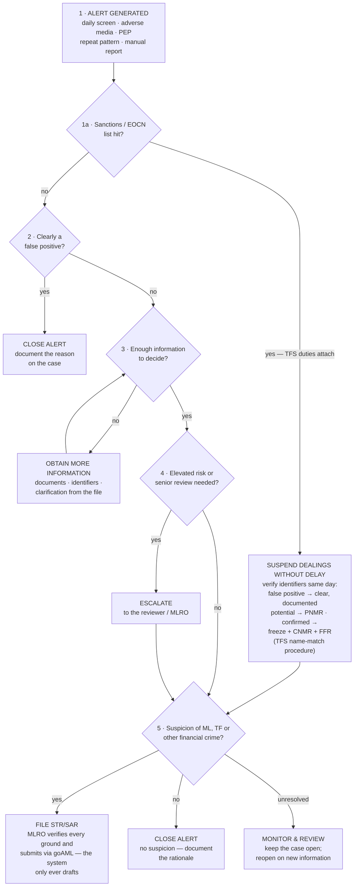

# Alert Investigation — Decision Tree

*The disposition path for a screening alert, from first look to close, escalation
or STR. Applies to every alert this system raises — daily sanctions screen,
adverse-media / PEP watch, repeat-pattern flags — and to anything reported
manually. First line works the tree; the STR decision itself is second-line only
(see the [reviewer / MLRO guide](reviewer-mlro-guide.md)).*

**Sanctions/EOCN list hits take the TFS gate first.** A designation-list match
carries duties an ordinary alert does not — suspend dealings **without delay**,
then PNMR/CNMR/FFR via goAML per the
[TFS name-match procedure](../aims/tfs-name-match-procedure.md) — *in addition
to*, never instead of, the STR question below.

**Goal: identify risk, make informed decisions, protect the organization.**
Not every alert is a true positive; good investigation prevents risk.

## The tree

## Key questions before any disposition

- What is the **nature** of the alert (list hit, adverse media, PEP, pattern)?
- Who is the **customer**, and what is their current **risk rating / band**?
- What exactly **triggered** it (which list, which story, which identifiers)?
- Do I have **enough information** to make a defensible decision?
- Is there a **suspicion** of money laundering, terrorist financing or another
  financial crime?

## Where each step lives in this system

| Tree step | Mechanism here |
|---|---|
| Alert generated | Daily sanctions screen + adverse-media/PEP watch file **screening cases** (Asana tasks) with confidence tiers; the delta engine surfaces only what is new |
| TFS gate (1a) | A sanctions/EOCN list hit suspends dealings immediately and follows the [TFS name-match procedure](../aims/tfs-name-match-procedure.md) (PNMR / CNMR + FFR via goAML, freeze without delay); internal-watchlist hits are **not** TFS events and take the ordinary path |
| False-positive check | Core-token FP suppression and confidence tiers do the first cut; the analyst documents the human call on the case |
| Obtain more information | A subject that cannot be screened cleanly (non-Latin / short name) is flagged **MANUAL REVIEW**, never assumed clear |
| Escalate | Hand-off to reviewer/MLRO; completion is second-line only (segregation of duties). Cases open past SLA get an **⏰ AGING** comment automatically |
| STR decision | **MLRO only**, with dual attestation (Federal Decree-Law 10/2025 Art. 16/18; FATF R.26). `ai.draft_str` attaches a grounds narrative to HIGH cases and [`str_dossier.py`](../../str_dossier.py) assembles a goAML-aligned **DRAFT** dossier — the system never files |
| Monitor & review | Keep the case open; the repeat-pattern watch (≥3 stories/90 days) and daily delta re-raise what changes |

## Documentation checklist — every disposition, every time

Undocumented work did not happen. Each case should carry:

- [ ] alert details & case ID
- [ ] customer information and identifiers used
- [ ] risk rating / band at the time of review
- [ ] investigation steps taken
- [ ] information reviewed (lists, versions, stories)
- [ ] evidence collected (attached to the case)
- [ ] decision & rationale
- [ ] approvals / escalations (who, when)
- [ ] final outcome
- [ ] date & time

The case task, the tamper-evident activity log and the sign-off fields are where
this record lives; the [assurance coverage matrix](../governance/assurance-coverage-matrix.md)
ties the trail to the controls that test it.

## Remember

- **Stay objective** — dispose of what the evidence shows, not what is quickest.
- **Follow the process** — the tree exists so identical facts get identical
  treatment.
- **Document everything** — the rationale is the deliverable, not the click.
- **When in doubt, escalate** — a false escalation costs minutes; a missed
  suspicion costs the licence.
- **Mind tipping-off (Art. 25)** — never signal to the customer that a report is
  being considered or filed; the Advisor refuses to draft such text by charter,
  and so should you.

*Right investigation. Right decision. Right outcome — stronger compliance, safer
organization.*
